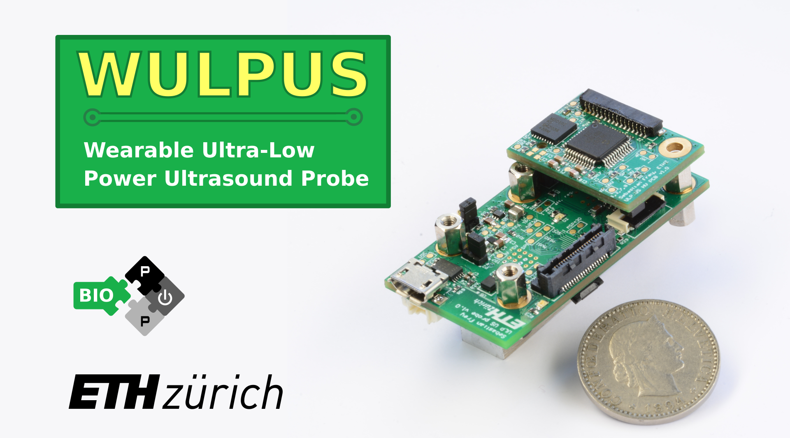
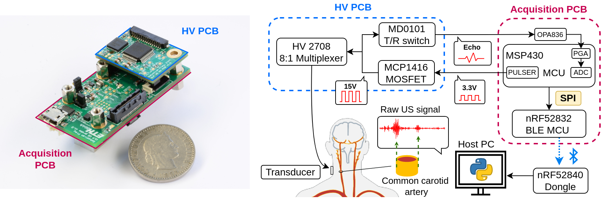

# WULPUS: 
## Wearable Ultra Low-Power Ultrasound

# Introduction

This repository contains the work in progress on the WULPUS ultrasound probe.

WULPUS is a truly wearable ultra-low-power open research ultrasound platform. 

The probe has the following features:
- **8 channels** (time-multiplexed)
- **8 Msps** Analog-to-Digital converter (12 bit resolution)
- **30.8 dB** Programable-Gain Amplifier + **10 dB** Operational Amplifier
- **Bluetooth Low Energy** (BLE) wireless link (320 kbps throughput)
- Up to **50 acquisitions per-second** (APS) (400 samples per acquisition, raw data streaming mode)
- **Compactness** (46 x25 mm footprint)
- **Ultra-Low Power** consumption of **22 mW** (raw data streaming mode, 50 APS)

# WULPUS system diagram

WULPUS probe comprises two printed circuit boards (PCBs):
- Acquisition PCB: featuring an ultrasound MCU (MSP430FR5043) and BLE MCU (nRF52832)
- High-Voltage PCB: featuring a High-voltage multiplexer (HV MUX), a transmit/receive switch, and a MOSFET driver.


WULPUS System Diagram

# Structure of the repository

This repository has the following folders:

- `fw`, containing the firmware source code, namely:
    - source code for the nRF52832 MCU of the WULPUS probe, located at `fw/nrf52/ble_peripheral/US_probe_nRF52_firmware`
    - source code for the nRF52840 USB dongle, located at `fw/nrf52/peripheral/US_probe_dongle_firmware`
    - source code for the MSP430 ultrasound MCU, located at `fw/msp430`
- `sw`, containing the Python code for the WULPUS Graphical User Interface
 
- `hw`, containing the Altium designer source files and pdf schematics for 
    - WULPUS Acquisition PCB (located at `hw/wulpus_acquisition_pcb`)
    - WULPUS High-Voltage PCB (located at `hw/wulpus_hv_pcb`)

- `docs`, containing the project documentation (e.g., images of the device, user manual, ...)

# How to reproduce?

To build your own instance of WULPUS, the following steps should be completed:
1. *PCBs manufacturing and assembly*<br>
   You can find the design files (Altium source files, schematics, bills of materials) under the `hw` folder.
2. *Flashing MSP430 firmware*<br>
   You can find the instructions on seting-up the toolchain, compiling the firmware and flashing the MSP430 MCU in the `fw/msp430` folder.
3. *Flashing nRF52 MCU and USB dongle firmware*<br>
   You can find the instructions on setting-up the toolchain, compiling the firmware, flashing the nRF52 MCU and USB dongle in the `fw/nrf52` folder.
4. *Python dependencies installation on the host PC*<br>
   Follow the instructions in the `sw` folder to install the dependencies.

# Usage

- Power up the probe, either from the micro-USB connector or from the battery connector
- Connect the USB dongle to the host PC
- Activate the Python environent, launch the Jupyter notebook located in `sw` folder, and follow the instructions in the notebook

# Citation
If you would like to reference the project, please cite the following paper:

```
@inproceedings{frey2022wulpus,
  title={WULPUS: a Wearable Ultra Low-Power Ultrasound probe for multi-day monitoring of carotid artery and muscle activity},
  author={Frey, Sebastian and Vostrikov, Sergei and Benini, Luca and Cossettini, Andrea},
  booktitle={2022 IEEE International Ultrasonics Symposium (IUS)},
  pages={1--4},
  year={2022},
  organization={IEEE}
}
```

## Authors

The WULPUS system was developed at the [Integrated Systems Laboratory (IIS)](https://iis.ee.ethz.ch/) at ETH Zurich by:
- [Sergei Vostrikov](https://scholar.google.com/citations?user=a0KNUooAAAAJ&hl=en) (Firmware, Software, Open-Sourcing)
- [Sebastian Frey](https://www.linkedin.com/in/sebastian-frey-8b576b194/) (Firmware, PCB design)
- [Luca Benini](https://scholar.google.com/citations?hl=en&user=8riq3sYAAAAJ) (Supervision, Conceptualization)
- [Andrea Cossettini](https://scholar.google.com/citations?user=d8O91jIAAAAJ&hl=en) (Supervision, Project administration)

# References

[1] - Frey, Sebastian, Sergei Vostrikov, Luca Benini, and Andrea Cossettini. "WULPUS: a Wearable Ultra Low-Power Ultrasound probe for multi-day monitoring of carotid artery and muscle activity." In 2022 IEEE International Ultrasonics Symposium (IUS), pp. 1-4. IEEE, 2022.

# License
The following files are released under Apache License 2.0 (`Apache-2.0`) (see `sw/LICENSE`):

- `sw/`

The following files are released under Solderpad v0.51 (`SHL-0.51`) (see `hw/LICENSE`):

- `hw/`

The following files are released under Creative Commons Attribution 4.0 International
License (`CC-BY-4.0`) (see `docs/images/LICENSE`):

- `docs/images/`

The `fw/msp430/` and `fw/nrf52/` directories contain third-party sources that come with their own
licenses. See the respective folders and source files for the licenses used.

# Limitation of Liability
In no event and under no legal theory, whether in tort (including negligence), contract, or otherwise, unless required by applicable law (such as deliberate and grossly negligent acts) or agreed to in writing, shall any Contributor be liable to You for damages, including any direct, indirect, special, incidental, or consequential damages of any character arising as a result of this License or out of the use or inability to use the Work (including but not limited to damages for loss of goodwill, work stoppage, computer failure or malfunction, or any and all other commercial damages or losses), even if such Contributor has been advised of the possibility of such damages.
