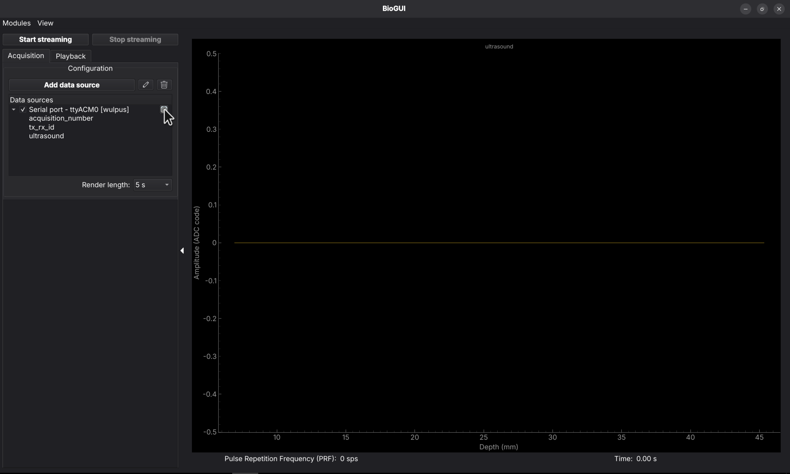
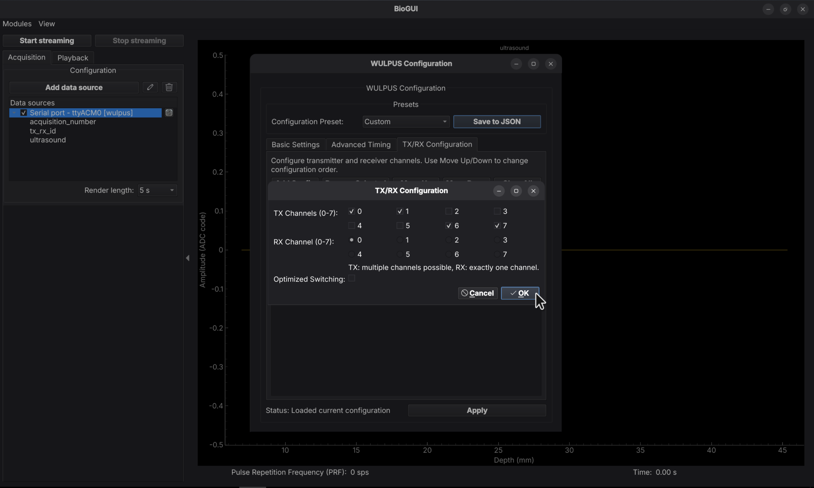
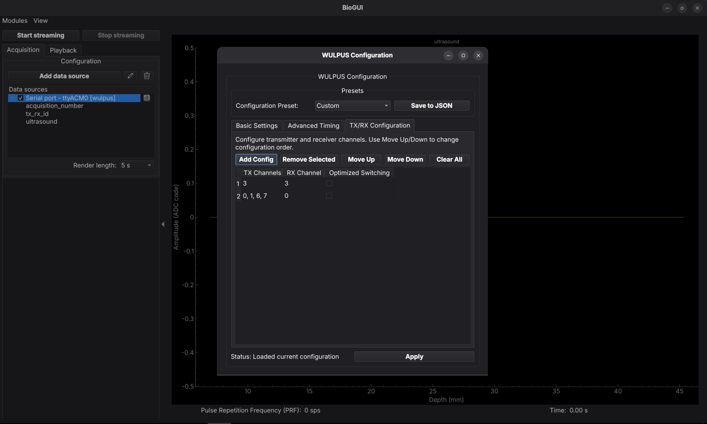
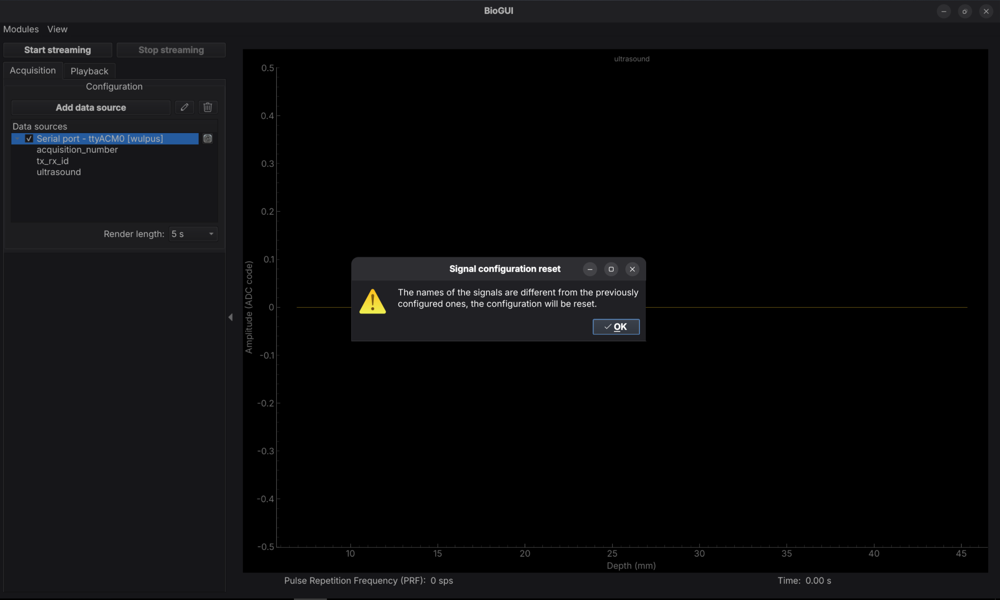
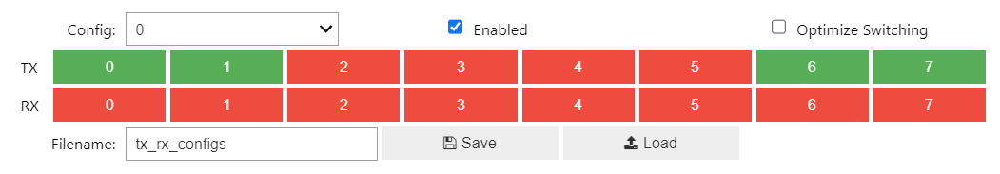
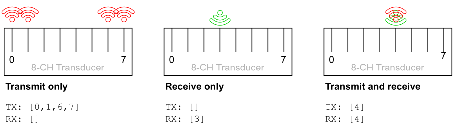
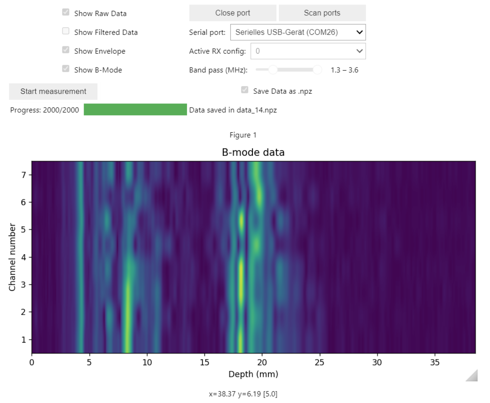
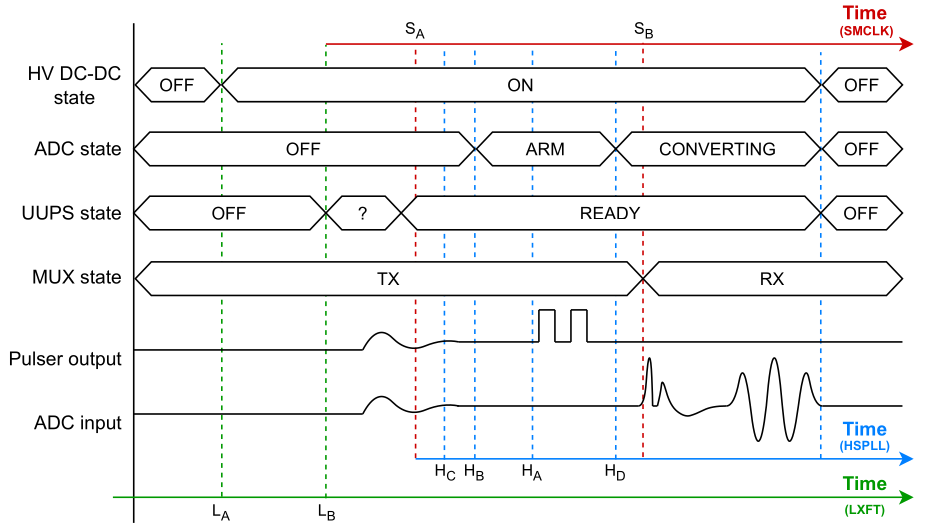

# Advanced Settings

This chapter describes the advanced settings of the WULPUS platform which can be tuned for a specific transducer and application.

TX/RX configuration in [BioGUI](https://github.com/pulp-bio/biogui) is the default path. The Jupyter notebook controls are kept afterwards as the legacy option. The timing diagram, the parameter list, and the B-mode example do not depend on a particular window layout. The B-mode image itself is still the original notebook screenshot.

## Transmit/Receive (TX/RX) configurations {#tx-rx-configurations}

### Theoretical overview

To perform an acquisition, WULPUS needs to know on which channels to transmit (receive) the pulses. This is done by supplying an array of TX (RX) channels. These two inputs (TX and RX array) determine which elements of the transducer array are active during acquisition.

**TX channels**

Multiple TX channels can be activated at a time, reflecting the elements of the transducer array that will transmit a signal simultaneously. This array of TX channels allows for a broader or more focused area of signal transmission, depending on the experiment's requirements.

**RX channels**

Multiple RX channels can be input at a time, reflecting the elements of the transducer array that will be connected in parallel to receive a signal simultaneously.

!!! note
    Since WULPUS has a single ADC channel, multiple channels can not be sampled simultaneously. Instead, when activating a few channels in parallel for the reception, the echo signals from all the connected channels (transducer elements) will be summed up in the analog domain and then sampled by the ADC.

One set of TX/RX channels can be either TX or RX channels or both simultaneously. This set is also called "configuration set".

WULPUS supports multiple (16 max.) configuration sets. These configurations are stored and will be executed in a round-robin fashion. This means that WULPUS will cycle through the configurations sequentially, using each set for signal transmission and/or reception before moving to the next. This approach is beneficial for conducting experiments that require data from e.g. multiple transducer channels or for quickly iterating through different test scenarios without manual reconfiguration.

When setting up configurations, one must consider their experimental setup and the specific TX/RX channels that need to be activated. For instance, if the experiment involves scanning an area with a transducer array, the user would enable multiple TX channels to cover the area and select an appropriate RX channel to capture the reflected signal.

### Programming TX/RX configurations in BioGUI {#programming-tx-rx-configurations-via-gui}

Open the configuration from the Acquisition tab. In **Data sources**, click the settings icon on the WULPUS serial port.



*Settings icon next to the WULPUS data source.*

The window has three tabs. **Basic Settings** and **Advanced Timing** are the ultrasound-subsystem parameters from the next section. This section uses **TX/RX Configuration**. **Save to JSON** writes the current window to a file. **Configuration Preset** loads one back.


*TX/RX Configuration. The buttons above the table add, remove, and reorder rows.*

**Add Config** opens a dialog. Select the TX channels and the RX channel. **Optimized Switching** is the option from [MUX artifact mitigation](how-to-get-started.md#mux-artifact-mitigation).

The dialog below adds a configuration with TX channels 0, 1, 6, and 7 and RX channel 0.



*Adding a configuration with TX channels 0, 1, 6, and 7 and RX channel 0.*

**OK** appends the row. The top row runs first. **Move Up** and **Move Down** change that order. **Remove Selected** deletes the highlighted row. **Clear All** deletes every row.



*Two configurations. The second row is TX channels 0, 1, 6, and 7 with RX channel 0.*

**Apply** sends the configuration to the probe and closes the window. The plots stay as they are, unless the signal names change. Then BioGUI shows the warning below. Click **OK** and set the traces again, as in [Adding a WULPUS data source](how-to-get-started.md#adding-a-wulpus-data-source).



*This warning is not shown on every apply. Click OK, then configure the plots again.*

The names change when you add or remove a TX/RX row, change an RX channel while more than one row is active, reorder rows that use different RX channels, or switch **IMU active**. Changing timings, gain, the pulse settings, or only the TX channels leaves the plots in place.

!!! note
    In the Python API, we are always talking about channels 0–7 (zero-indexed), whereas in the hardware design files we talk about channels 1–8.

    In this user guide, we use the same numbering as in the Python API.

### Legacy Jupyter notebook {#legacy-jupyter-tx-rx-gui}

The notebook GUI can still edit the same configuration sets. It is not the recommended setup. Install and open it as described in [Legacy Jupyter notebook](how-to-get-started.md#legacy-jupyter-notebook).

The configuration below matches the `Transmit only` example visualized later in [Example configurations](#example-configurations): channels 0, 1, 6, and 7 transmit, and no channel is selected for receive.



*The legacy TX/RX configuration GUI. Configuration set 0 is selected, with channels 0, 1, 6 and 7 set to transmit, and no channels selected for receive.*

**Configuration selection and activation**

In the top part of the GUI, a dropdown list `Config` lists the configuration sets. Choose the set to edit and enable it with the `Enable` checkbox. Enabled sets run in a round-robin fashion, starting from the config with id=0.

**Channel selection**

The middle part is a row of TX buttons and a row of RX buttons. Green is active, red is inactive.

**Saving configurations to a file**

The lower part has a `Filename` box and **Save** / **Load** buttons. **Save** writes the enabled sets to a human readable `.json` file.

!!! note
    Disabled configuration sets will not be saved.

### Example configurations {#example-configurations}

Three examples of using the TX/RX configurations are visualized below.



*Three examples of using TX/RX configurations where the transmitting channels are indicated in red, the receiving channels in green.*

In the first example denoted as **Transmit only** (left), WULPUS is configured to send out pulses on channels `[0,1,6,7]` and not receive on any channel. This configuration corresponds to the legacy GUI settings demonstrated above. In the second **Receive only** example (center), WULPUS is configured to receive on channel `3` only. In the third example called **Transmit and receive** (right), WULPUS is configured to send and receive on channel `4` simultaneously.

!!! note
    In reality, the system doesn't transmit and receive exactly at the same time. "Simultaneously" means that the same channels are selected for TX and RX within the same excitation/readout cycle.

These three configuration sets could be assigned to different config ids (e.g. to 0, 1, 2) and put in one configuration file. If all configurations are enabled, WULPUS would then execute them in a round-robin manner:

```
Transmit only -> Receive only -> Transmit and receive ->
 -> Transmit only -> Receive only -> Transmit and receive -> ...
```

!!! note
    A user can program a sequence of a maximum of 16 configuration sets.

### "B-mode" data acquisition and visualization {#b-mode}

A user can potentially program 8 TX/RX configurations where each `n`'th config (with an id = `n`) receives the echo signal from the `n`'th channel of the linear array transducer (`n` ranges from 0 to 7). In this case, if the channels are ordered (pin mapping from the transducer's to WULPUS's channels is correct), the data can be shown as a 2D image. An example from the legacy notebook GUI is shown below.

!!! note
    Although we often call it "B-mode", the GUI does not perform beamforming. Instead, the raw ultrasound data is band-pass filtered, and an envelope (A-scan) is extracted. Later, when all 8 envelopes (A-scans) are collected, they are stacked into a 2D matrix which is visualized.

{ width="80%" }

*Legacy notebook GUI in B-mode while imaging a carotid artery. That GUI turns the view on with the Show B-mode checkbox. The picture is kept as an example of the stacked envelopes. BioGUI plots each TX/RX configuration as its own trace instead.*

Precisely, the view takes data from the `n`'th config set and plots it along the x-axis (depth) at coordinate y=`n` (there are eight discrete y-coordinates). A user thus needs to program eight TX/RX config sets, where for each config set one channel is activated to RX. For the best image quality, we suggest activating all the channels during TX.

For the example measurement shown above, the employed TX/RX configs were the following:

| **Config set no.** | 0 | 1 | 2 | 3 | 4 | 5 | 6 | 7 |
| --- | --- | --- | --- | --- | --- | --- | --- | --- |
| **TX channels** | 0–7 | 0–7 | 0–7 | 0–7 | 0–7 | 0–7 | 0–7 | 0–7 |
| **RX channels** | 0 | 1 | 2 | 3 | 4 | 5 | 6 | 7 |

*RX/TX configs for B-mode.*

## Configuration of Ultrasound Subsystem {#configuration-of-ultrasound-subsystem}

!!! note
    As defined earlier, we call **acquisition** a certain number of samples with a period between them determined by the ADC sampling frequency. Moreover, we call a set of acquisitions a **measurement**.

After power-up, the WULPUS probe waits for the configuration package to arrive from the host PC. This configuration package contains TX/RX configurations (see [Programming TX/RX configurations in BioGUI](#programming-tx-rx-configurations-via-gui)) along with the settings of the ultrasound subsystem responsible for managing all the steps of the acquisition (e.g. pulse generation, start ADC sampling etc).

In BioGUI those settings are the **Basic Settings** and **Advanced Timing** tabs of the same window. The labels below are the ones on those tabs. The numbers are the default settings.

BioGUI does not ask for a number of acquisitions. Streaming runs until you click **Stop streaming**. The legacy notebook GUI had that count and stopped itself when it was reached.

**Ultrasound subsystem configuration parameters**

| Parameter name | Label in BioGUI | Default | Description/Note |
| --- | --- | --- | --- |
| ***Basic Settings*** | | | |
| `dcdc_turnon` | DC-DC Turn On Time (µs) | 100 | HV DC-DC converter is enabled |
| `meas_period` | Measurement Period (µs) | 321965 | Time between acquisitions |
| `pulse_freq` | Pulse Frequency (Hz) | 2250000 | Frequency of the pulses |
| `num_pulses` | Number of Pulses | 2 | *L* pulses to generate |
| `sampling_freq` | Sampling Frequency (Hz) | 8000000 | ADC sampling frequency |
| `num_samples` | Number of Samples | 400 | *K* samples per acquisition |
| `rx_gain` | RX Gain (dB) | 3.5 | Gain of the MSP430 PGA |
| ***Advanced Timing*** | | | |
| `start_hvmuxrx` | HV-MUX RX Start Time (µs) | 500 | MUX switches from TX to RX |
| `start_ppg` | PPG Start Time (µs) | 500 | Pulse generation starts |
| `turnon_adc` | ADC Turn On Time (µs) | 5 | ADC is turned on |
| `start_pgainbias` | PGA In Bias Start Time (µs) | 5 | Input biasing is enabled |
| `start_adcsampl` | ADC Sampling Start Time (µs) | 503 | ADC starts sampling |
| `restart_capt` | Capture Restart Time (µs) | 3000 | (reserved, not used) |
| `capt_timeout` | Capture Timeout (µs) | 3000 | (reserved, not used) |

*Default settings.*

In total, there are three groups of configuration settings which are described in detail below.

**Measurement settings**

`meas_period` is the time between consecutive acquisitions. BioGUI calls it **Measurement Period**. It is inversely proportional to the acquisition rate.

**IMU active**, on the same tab, records IMU samples with each acquisition. Leave it off when you only want ultrasound. With it off, all 400 samples are ultrasound.

The ADC sampling frequency is **Sampling Frequency**.

!!! note
    The default, and the current firmware, use 400 samples per acquisition. BioGUI shows that value as **Number of Samples**.

**Excitation settings**

The second group determines the excitation pattern for the ultrasound transducer. The WULPUS system produces unipolar excitation pulses with an amplitude of 15 V (from 0 V to +15 V). **Pulse Frequency** and **Number of Pulses** set that pattern.

!!! note
    The duty cycle of the pulses is currently fixed to 50% in the API but can potentially be adjusted at runtime.

**Advanced settings**

The third group sets the time marks of the acquisition, including **DC-DC Turn On Time** on the Basic Settings tab. These timings have to fulfill certain requirements for a successful acquisition. Since the understanding of these timings is important to get the full potential out of these settings, the principle of how they work is explained further.



*Timing diagram for the internal events of the MSP430 MCU during a single ultrasound acquisition. Colors relate internal events to the clock domain: blue denotes events whose time stamps are coupled with the high-speed PLL (HSPLL) clock domain of the MSP430, red corresponds to sub-system master clock (SMCLK), green stands for low frequency crystal (LFXT).*

A short overview of the timings during one acquisition is displayed in the figure above. Preparation for the acquisition starts with the event L<sub>A</sub> responsible for turning on the high-voltage DC-DC converter. This converter supplies the +15 V power domain used to generate excitation pulses. Next, during the L<sub>B</sub> event the MSP430 MCU wakes up, prepares the ultrasound subsystem for the acquisition and activates the universal ultrasound power supply (UUPS) module. This module requires some time to get ready. Therefore, the firmware also initializes a timer (clocked by the SMCLK domain), sets a delay equal to approx. 9 µs and starts the timer. When the timer elapses, an event S<sub>A</sub> happens. Up until this moment, the UUPS module is typically in the READY state (but if not, we wait further until it is ready). Next, we configure the SMCLK-based timer with the timestamp S<sub>B</sub> which will be later responsible for switching the HV multiplexer from the transmit to receive state. Then, we immediately trigger an ultrasound acquisition. Later steps are automatically performed by the dedicated hardware acquisition sequencer (ASQ) of the MSP430 without involving the CPU at all. This means that the hardware automatically applies an RX bias (H<sub>C</sub>), turns on the sigma-delta high-speed ADC (H<sub>B</sub>), triggers the programmable pulse generator (H<sub>A</sub>) and starts sampling the input signal (H<sub>D</sub>). The only exception is the event S<sub>B</sub> when the CPU wakes up from the timer event to switch the HV multiplexer to the receive state. Finally, the acquisition finishes when all the required samples are acquired, and all the US-related peripheral modules are turned off until the L<sub>A</sub> and L<sub>B</sub> events happen again in the next acquisition.

A user can flexibly configure the timings of the internal events. The mapping of the internal parameters to the BioGUI labels is summarized below.

| Event | Clock | Label in BioGUI | Function |
| --- | --- | --- | --- |
| L<sub>A</sub> | LFXT | DC-DC Turn On Time | Turn on HV DC-DC |
| L<sub>B</sub> | LFXT | Measurement Period | Turn on UUPS |
| S<sub>A</sub> | SMCLK | — | Trigger Acquisition Sequencer |
| S<sub>B</sub> | SMCLK | HV-MUX RX Start Time | Switch HV MUX to receive |
| H<sub>A</sub> | HSPLL | PPG Start Time | Trigger pulse generator |
| H<sub>B</sub> | HSPLL | ADC Turn On Time | Turn on sigma-delta ADC |
| H<sub>C</sub> | HSPLL | PGA In Bias Start Time | Apply receive bias |
| H<sub>D</sub> | HSPLL | ADC Sampling Start Time | Start sampling the input signal |

*The six timing points and their corresponding parameters.*

!!! note
    The S<sub>A</sub> event is fixed in firmware with respect to L<sub>B</sub> so that S<sub>A</sub> − L<sub>B</sub> = 9 µs.

!!! note
    L<sub>B</sub> is a central event of the whole acquisition, since it triggers the SMCLK-based timer/events which is responsible for triggering the acquisition sequencer operating in the HSPLL domain (see the timing diagram).

!!! note
    While changing the Measurement Period (L<sub>B</sub> event), a user should also adapt the DC-DC Turn On Time (L<sub>A</sub> event) so that the HV DC-DC converter has enough time to start up and generate the +15 V power domain.

While adapting the advanced settings, a user must follow the recommendations below (otherwise, the system will not work):

- The DC-DC converter has to be turned on and settled before starting pulsing.
- The pulsing has to be finished before the MUX switches to RX.
- The PGA input (receive) bias has to be settled before the ADC is triggered.
- The ADC has to be turned on and ready before the ADC is triggered.
- The MUX has to be settled to RX early enough to capture early echo-signals.
- The previous acquisition must be finished before the next acquisition starts.

Since the WULPUS probe uses multiple clock domains originating from different sources (see schematics for details), some variations between different WULPUS probes may occur such as slight misalignment of the HV MUX artifact caused by the switching event S<sub>B</sub> (see the timing diagram). For the best results, we recommend starting from the default values in the table above and tuning **HV-MUX RX Start Time**.
