# How to build your own WULPUS probe?

## PCB manufacturing and assembly

Hardware files (Altium Nexus CAD projects, PDF schematics, `.xlsx` BOMs) can be found in the `hw` directory in the GitHub repository.

The manufacturing of Printed Circuit Boards (PCBs) is a flexible process that can be tailored to specific needs and expertise levels. Generally, there are two main approaches to consider:

1. **Self-Assembly:** Order the PCBs and personally handle the assembly of all components, including microcontrollers, passive elements, and other necessary parts.
2. **Full-Service Manufacturing:** Opt for a comprehensive solution where the manufacturer not only produces the PCBs but also takes care of assembling all the components onto the boards.

The choice between these options largely depends on your experience, resources, and project requirements.

### Self-Assembly

When choosing to assemble the PCBs on your own, the PCB manufacturer of your choice only needs to fabricate the PCBs itself. For this, you can provide the manufacturer with the following files:

1. **Gerber files:** These files play a crucial role as they are the standard format used to describe the layout of the PCB. They contain information about the copper layers, solder mask, silkscreen, and any additional layers that are part of the PCB design. Essentially, Gerber files communicate with the manufacturing equipment what to produce, showing where to lay down copper, where to apply protective coatings, where to place holes, and so on. They are used to guide the photolithography machines that create the PCB layers. Each layer of the PCB (for example, top copper, bottom copper, solder mask layers, etc.) will have its own Gerber file. The files can be found in `hw/<pcb>/docs/fabrication_files/Gerber`.
2. **NC Drill files:** These files are used to instruct the drilling machines on where to drill holes in the PCB. These files provide the coordinates and sizes of the holes that need to be drilled, including vias (which connect different layers of the PCB), mounting holes, and any other through-holes required for components. The NC drill files are located in `hw/<pcb>/docs/fabrication_files/NC Drill`.
3. **The stackup** of the PCB refers to the arrangement of copper layers and insulating materials (dielectrics) in a PCB to form the complete board structure. It's an essential part of PCB design and manufacturing, as the stackup affects the board's electrical performance, including its impedance, signal integrity, and thermal management. The suggested stackup is located in `hw/<pcb>/docs/fabrication_files/<pcb>_stackup.xls`.

Self-assembly is only recommended for those who have previous experience with soldering and have good soldering equipment such as a variable temperature soldering iron, soldering dispenser, solder wick, flux, tweezers, a magnifying glass or microscope, and ideally a hot air station or a reflow oven.

### Full-Service Manufacturing

A convenient way to get your own WULPUS is to opt for full-service manufacturing. In this case, the manufacturer is not only producing the PCBs, but also takes care of ordering the electronic components and their assembly. In addition to the files mentioned above, you should provide the manufacturer with the following ones:

1. **Pick-and-place files:** They are needed during the assembly process, particularly during the automated placement of components onto the board. These files contain detailed information about the components to be placed on the PCB, including their exact locations, orientations, and reference designators. This information guides the automated pick-and-place machines that physically place components on the board during assembly. The pick-and-place files can be found in `hw/<pcb>/docs/fabrication_files/Pick Place`.
2. **Assembly drawing:** This is a detailed diagram that provides comprehensive information on how various components are to be assembled on the PCB. This drawing serves as a visual guide for the assembly process, highlighting the placement of components, their orientations, and any special assembly instructions. The assembly drawing is located in `hw/<pcb>/docs/<pcb>_assembly_drawing.pdf`.
3. **The Bill of Materials (BOM):** A list that contains all components that should be assembled on the PCB. The BOM specifies not just what components are needed but also their designator and quantities. The BOM is located in `hw/<pcb>/docs/<pcb>_bom.xls`.

### Cost estimation

The overall cost of a WULPUS probe is highly dependent on how many pieces per production batch are produced. In the case of a batch of around 10 to 20 probes, the expected cost per WULPUS probe lies in the range of **150 to 200 USD**, depending on the chosen PCB manufacturer, the component costs and if the assembly is handled by the manufacturer or not.

## Powering up the US probe {#powering-up-the-us-probe}

There are four different powering configurations for WULPUS. You can either power it from USB or from the battery port. The system voltage VSYS,MCU can also be configured to be either 2.5 V or 3.3 V.

To select these configurations, you have two jumpers **P1** and **P2**, which can both take two positions (1-2 and 2-3, thus pins 1 and 2 bridged or pins 2 and 3 bridged, respectively). Each jumper has its pin 1 marked by a dot.

The default configuration is powered from USB, 3.3 V, as shown below. The jumper functions are again described in the table.

| | **1-2** | **2-3 (default)** |
| --- | --- | --- |
| **P1** | 2.5 V | 3.3 V |
| **P2** | Battery | USB |

*Power jumpers and their functions.*

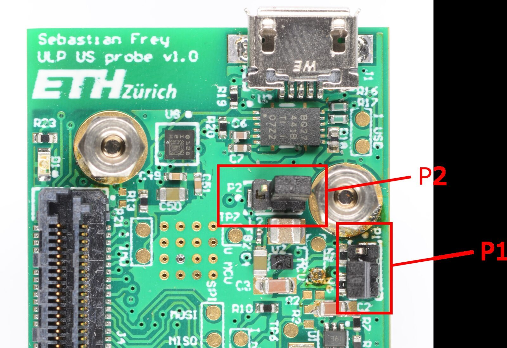{ width="80%" }

*Default positions of the power jumpers.*

## Programming the MSP430 {#programming-the-msp430}

In order to program the MSP430, you need the following components (see figure below):

1. MSP FET programmer
2. JTAG - Mr. Wolf adapter PCB
3. Molex cable 8-pin
4. 8 Jumper cables (female to female)
5. USB cable (type B to mini USB)

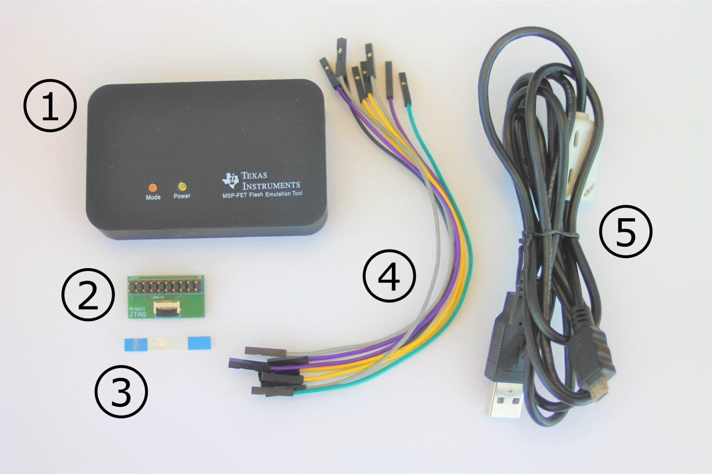{ width="80%" }

*Components programming MSP430.*

### Setting up the toolchain

**TI Code Composer Studio (CCS) (V11.0.0.00012)**

1. Go to [https://www.ti.com/tool/CCSTUDIO#downloads](https://www.ti.com/tool/CCSTUDIO#downloads) and download the single file installer
2. Extract the downloaded file and run `ccs_setup_11.0.0.00012`
3. Choose `Custom installation`
4. In `Select Components`, select `MSP430 ultra-low power MCUs` and finish the installation

**MSP430Ware (V3.80.14.01)**

1. Open Code Composer Studio
2. Go to `View -> Resource Explorer`
3. Select `Software -> MSP430Ware (3.80.14.01)` and install it

**Add driverlib to CCS (V2.91.13.01)**

1. Close CCS
2. Go to [https://www.ti.com/tool/MSPDRIVERLIB#downloads](https://www.ti.com/tool/MSPDRIVERLIB#downloads) and download MSPDRIVERLIB
3. Extract the downloaded file and copy the extracted folder into your CCS installation (e.g. `C:\ti\msp430_driverlib_2_91_13_01`)
4. Open CCS
5. Go to `Windows -> Preferences -> Code Composer Studio -> Products`
6. Click on `Add...` to add the driverlib path to the product discovery path (e.g. `C:\ti\msp430_driverlib_2_91_13_01\driverlib`)
7. Click on `Rediscover...`
8. Select the option for `driverlib`, press `Install` and agree to restart CCS

### Flashing the device

**Open the project in CCS**

1. Open CCS and set your workspace
2. Select `File -> Import -> CCS Project -> Next`
3. Select `Search Directory`, set it to `wulpus/fw/msp430/wulpus_msp430_firmware`
4. Select discovered project `wulpus_msp430_firmware` and click `Finish`

**Build the project**

1. Select `Project -> Build Project`
2. Build the project

{ width="60%" }

*Connection between the MSP JTAG adapter and the MSP-FET.*

**Flash the project**

1. Connect the MSP FET programmer to the US probe using the 8-pin Molex connector according to the figure above
2. Power the US probe as described in [Powering up the US probe](#powering-up-the-us-probe)
3. Select `Run -> Load -> Select Program to Load`
4. Navigate to the `Debug` subfolder of the CCS project and select the file with the extension `.out`
5. Flash the code via the Flash icon in CCS or via `Run -> Load -> ...`

## Programming the nRF52 on the Acquisition PCB {#programming-the-nrf52-on-the-acquisition-pcb}

The nRF52 MCU can be programmed with a J-Link Debugger. The following components are needed to do so (see figure below):

1. J-Link Debugger
2. Adapter PCB NRF SWD
3. Molex cable 6-pin
4. USB cable (type A to type B)
5. JTAG 2x7 Ribbon Cable

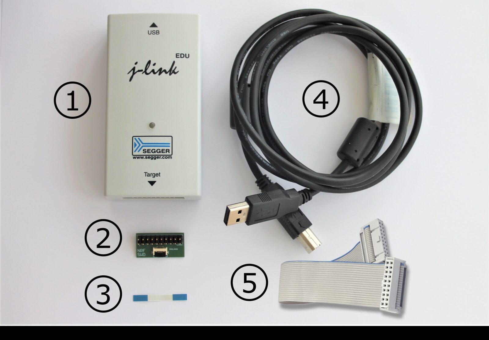{ width="80%" }

*Components programming nRF52.*

### Setting up the toolchain {#setting-up-the-nrf52-toolchain}

For a more detailed Getting Started Guide with other IDE options, see [https://infocenter.nordicsemi.com/topic/ug_gsg_ses/UG/gsg/intro.html](https://infocenter.nordicsemi.com/topic/ug_gsg_ses/UG/gsg/intro.html) and select `Getting started with nRF5 SDK and SES (nRF51 & nRF52 Series) -> Setting up your toolchain`. Be aware that the WULPUS firmware project is only configured in SES. If it were to be used in other IDEs, some configurations would have to be made manually.

!!! note
    The nRF projects are compatible with the nRF SDK SES version (5.42a or 5.62). Under the new version (7.32) compilation of the Dongle firmware fails.

**Segger Embedded Studio (SES) for ARM (v5.62)**

Go to [https://www.segger.com/downloads/embedded-studio](https://www.segger.com/downloads/embedded-studio), download and install the `v5.62` installer for your OS.

**(Optional) Obtain a free license for SES**

You can leave out this step if you only use SES for academic purposes and are ok with accepting a prompt every time you open SES.

1. Go to [https://license.segger.com/Nordic.cgi](https://license.segger.com/Nordic.cgi)
2. Fill in the requested information, the license will then be sent to your mail
3. Open Segger Embedded Studio
4. Click `Tools -> License Manager`
5. Select `Activate SEGGER Embedded Studio`
6. Paste in your license and click on `Install license`

**Note:** After doing this, it may take a few hours until the license is activated.

**Segger J-Link Software and Documentation Pack (v7.56)**

Go to [https://www.segger.com/downloads/jlink](https://www.segger.com/downloads/jlink), download and install the `v7.56` installer for your OS.

**Nordic nRF5 SDK (V17.1.0)**

1. Go to [https://www.nordicsemi.com/Products/Development-software/nRF5-SDK](https://www.nordicsemi.com/Products/Development-software/nRF5-SDK), download and unpack the `v17.1.0` package.
2. Place the unpacked folder close to the root level of your file system (e.g. `C:/nordic/nRF5_SDK_17.1.0_ddde560/` or `~/nordic/nRF5_SDK_17.1.0_ddde560/`). Try not to use any spaces in the file path or folder name.
3. Copy the contents of the folders `ble_peripheral` and `peripheral` of the [firmware section of the repository](https://github.com/pulp-bio/wulpus/tree/main/fw/nrf52) into the counterparts of the same name in the `examples` folder of the SDK (e.g. `C:/nordic/nRF5_SDK_17.1.0_ddde560/examples/`)
4. Inside each copied project (e.g. `US_probe_xxx_firmware`), in the subdirectory `pca100xx/s1xx/ses/`, you will find a `.emProject` file. You can then open this file with Segger Embedded Studio to open the project.

### Flashing the device

1. Locate the `.emProject` file in the SDK's subfolder `examples/ble_peripheral/US_probe_nRF52_firmware` as described in [Setting up the toolchain](#setting-up-the-nrf52-toolchain) and open it with Segger Embedded Studio.
2. In the file `us_defines.h`, change `DEVICE_NAME` to the name you want to use for the BLE connection. The default value is `WULPUS_PROBE_3`.
3. Connect the US probe with the J-Link debugger and the 6-Pin Molex connector
4. Flash the code via `Build -> Build and Run`
5. Power cycle the probe to start the execution of the code

## Programming the USB Dongle {#programming-the-usb-dongle}

The dongle can be programmed directly through USB; no additional hardware is needed.

### Setting up the toolchain

**Nordic nRF Connect for Desktop (V3.7.1 or newer versions)**

1. Go to [https://www.nordicsemi.com/Products/Development-tools/nRF-Connect-for-desktop](https://www.nordicsemi.com/Products/Development-tools/nRF-Connect-for-desktop), download and install the `V3.7.1` (or newer) installer for your OS.
2. Open nRF Connect for Desktop
3. `Install` the `Programmer` application

**SoftDevice S140 (V7.2.0)**

Go to [https://www.nordicsemi.com/Products/Development-software/S140](https://www.nordicsemi.com/Products/Development-software/S140), download and unpack (no specific location) the `V7.2.0` version.

### Flashing the device

**Build the Firmware**

1. Locate the `.emProject` file in the SDK's subfolder `examples/peripheral/US_probe_dongle_firmware` as described in [Setting up the toolchain](#setting-up-the-nrf52-toolchain) and open it with Segger Embedded Studio.
2. In the file `us_ble.c`, change `DEVICE_NAME_TO_CONNECT` to the **same name** you chose to use in the probe's firmware (e.g. `WULPUS_PROBE_3`).
3. Build the code via `Build -> Build`
4. The resulting `US_probe_dongle_firmware.hex` is then located in the folder `pca10059/s140/ses/Output/Debug/Exe/`

**Flash both the Firmware and SoftDevice**

1. Open nRF Connect for Desktop and launch the Programmer application
2. Plug the dongle into a USB port
3. Press the reset button to put the Dongle in DFU mode. Note that the reset button is the sideways button right next to the better visible SW1 button on the Dongle
4. Select the dongle from the dropdown in the upper left corner of the Programmer app
5. Click `Add HEX file` to select the firmware hex file built above
6. Click `Add HEX file` to select the SoftDevice hex file downloaded previously
7. Click `Write` to write the firmware to the dongle

## Silicone Rubber Package for WULPUS Probe {#silicone-rubber-package}

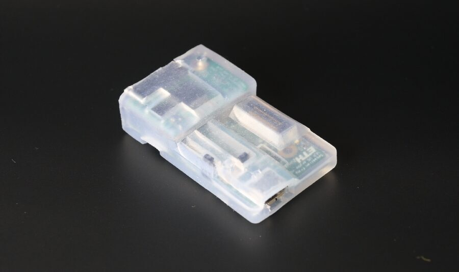{ width="80%" }

*Silicone rubber package for WULPUS probe.*

A silicone package can optionally be produced to protect the probe from mechanical shocks and electrostatic discharges. This section provides a list of materials required for creating this package, followed by detailed fabrication steps.

### Bill of Materials

To build the silicone package, you will need the following items:

- [Ecoflex™-0045 NEAR CLEAR, Silicone Rubber](https://www.kaupo.de/shop/en/SILICONE-RUBBER-Platinum-Cure/ECOFLEX-SERIES/Ecoflex-0045-Near-Clear/Ecoflex-0045-1-NEAR-CLEAR.html).
- The package's mold.
- 2× Dowel pins, 2.5 mm × 20 mm or longer.
- Disposable containers.
- Nitrile gloves.
- Vaseline.
- A vacuum pump.

#### Crafting the Mold

The files for the mold are available in the folder `hw/wulpus_silicone_package` of the repository. The mold can be fabricated using additive manufacturing techniques (3D printing such as FDM, SLA, DLS, etc.) or ordered from a 3D printing service.

#### DIY 3D Printing

If you can access an FDM 3D printer, you can use it to create the mold. It is recommended to use the files `*_fdm.stl`, which already incorporate tolerances for proper fitting. Standard materials such as PLA, ABS, or PETG are suitable. After printing and removing supports, the mold will be ready for use.

#### Ordering the Mold

If a 3D printer is unavailable, you can order the mold from a 3D printing service provider, such as [PCBWay](https://www.pcbway.com/rapid-prototyping/manufacture/). In this case, please use the SLA technology, upload the `.stl` files `*_resin.stl` and select "Resin, Standard white material (UTR 8360)" as the material. Ensure the option "Wall thickness risk" is allowed for the inner mold part.

### Production Steps {#silicone-package-production-steps}

It is highly recommended to wear nitrile gloves throughout these steps, especially when handling the Ecoflex™ silicone rubber.

#### Preparing the Mold

1. Coat the walls of the hollow part of the mold with Vaseline.
2. Insert the inner mold part, ensuring the holes on both parts align.
3. Insert the dowel pins into the holes. Verify proper alignment by ensuring the inner and outer parts make contact at the designated points (see figure below).

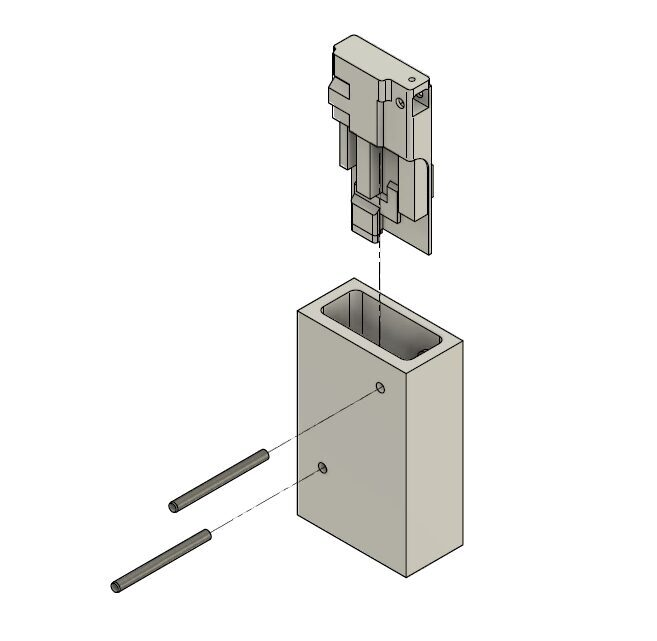{ width="45%" }
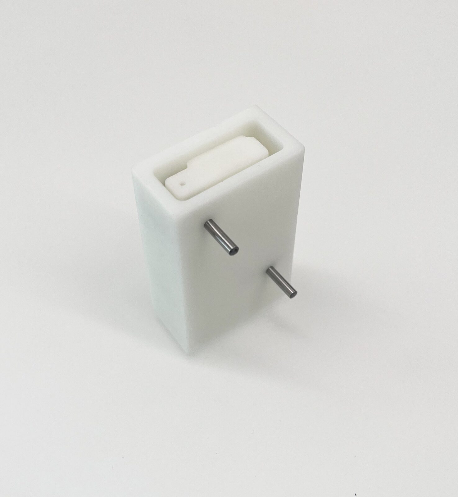{ width="45%" }

*3D printed mold for the WULPUS silicone package: assembly drawing (left) and assembled mold (right).*

#### Mixing the Ecoflex™

1. Thoroughly pre-mix Parts A and B before starting.
2. Dispense 10 ml of each part (A and B) into the mixing container (1:1 ratio by volume or weight).
3. Mix thoroughly, ensuring you scrape the container's sides and bottom multiple times.
4. Vacuum degas the mixture to remove air bubbles:
    1. Ensure your vacuum pump can achieve at least 29 inches of mercury (1 Bar / 100 kPa).
    2. Leave enough room in the container for material expansion.
    3. Continue vacuuming until the mixture rises, breaks, and falls, then vacuum for another minute.

!!! note
    Refer to the figure below during the degassing procedure.

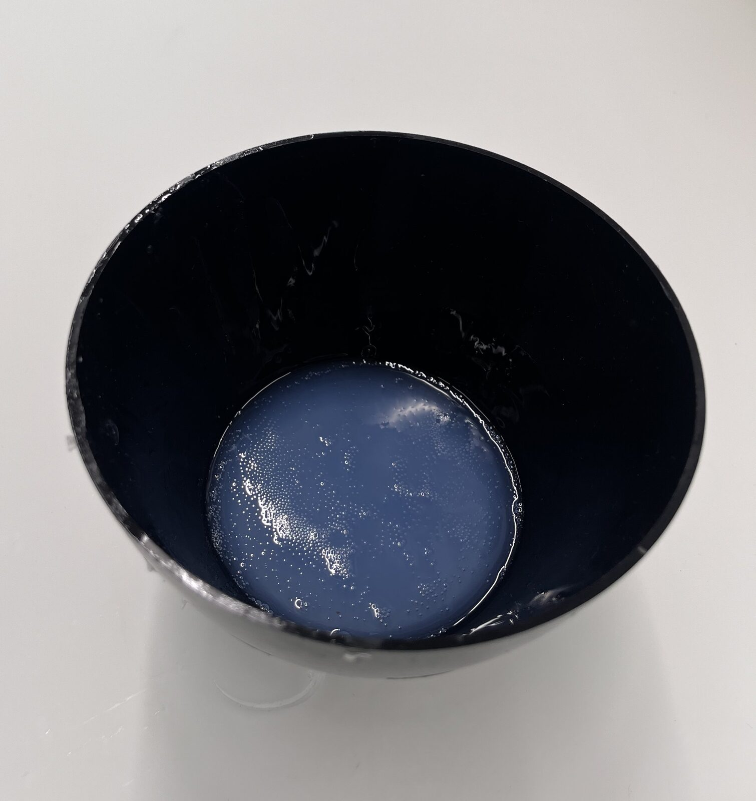{ width="45%" }
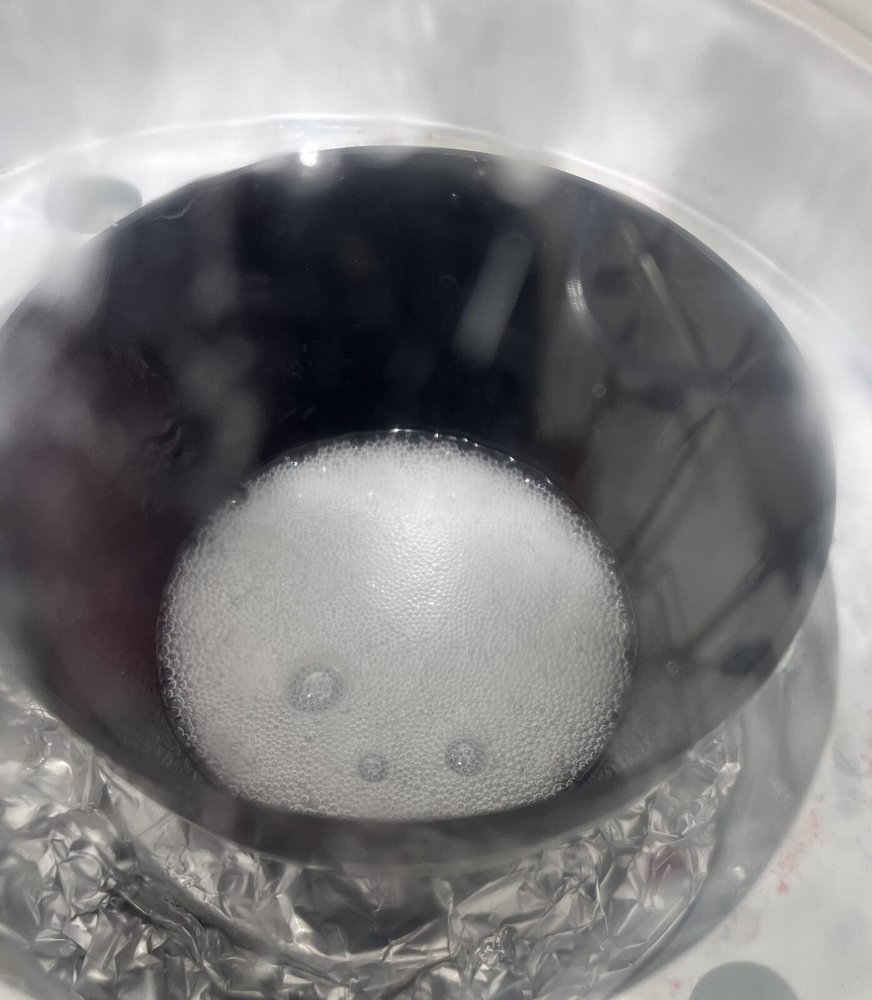{ width="45%" }

*Preparing the Ecoflex silicone rubber: mixed components (left) and degassing (right).*

#### Pouring the Ecoflex™ Mixture

1. Secure the mold in a vertical position and slowly pour the Ecoflex mixture until the mold's top surface is reached.
2. Allow the silicone rubber to cure vertically for approximately four hours.

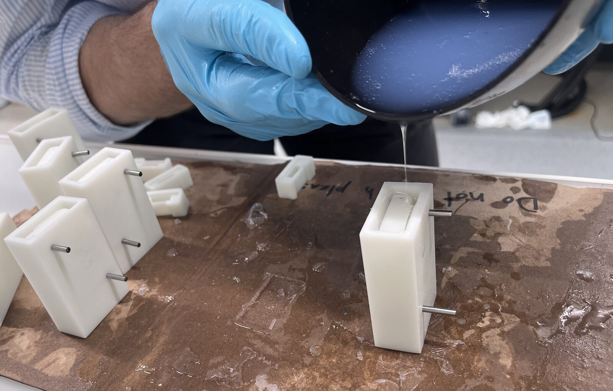{ width="55%" }
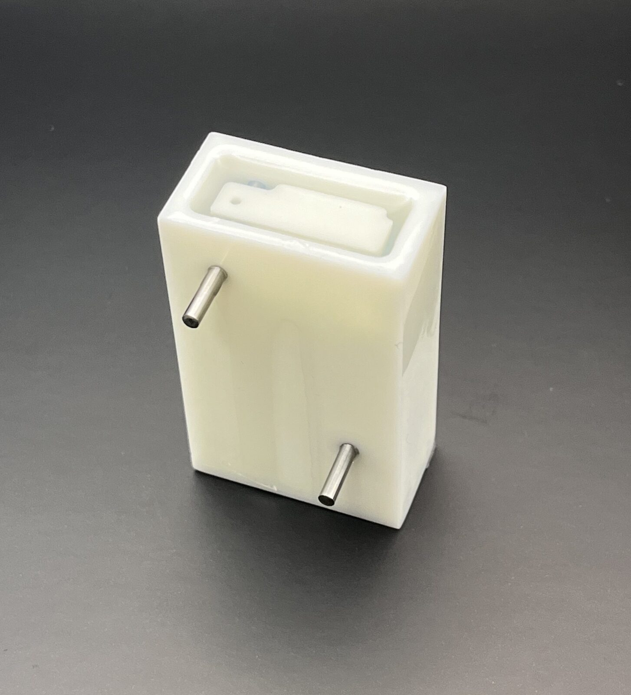{ width="35%" }

*Pouring the Ecoflex mixture into the mold (left) and the filled mold (right).*

#### Removing the Sacrificial Parts

1. Once cured, remove the dowel pins.

    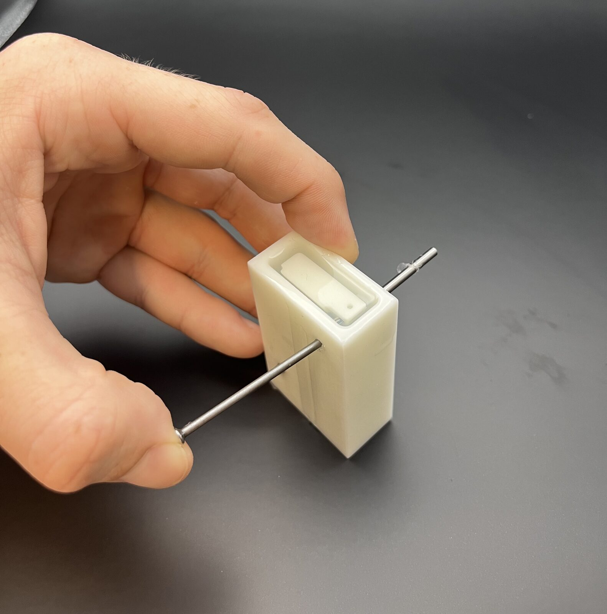{ width="40%" }

    *Removing the dowel pins.*

2. Gently remove the silicone blank from the mold.

    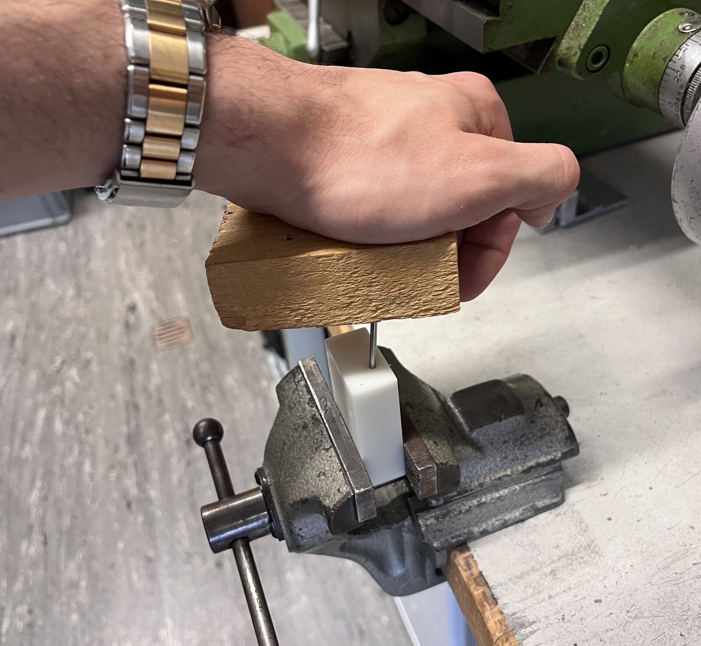{ width="30%" }
    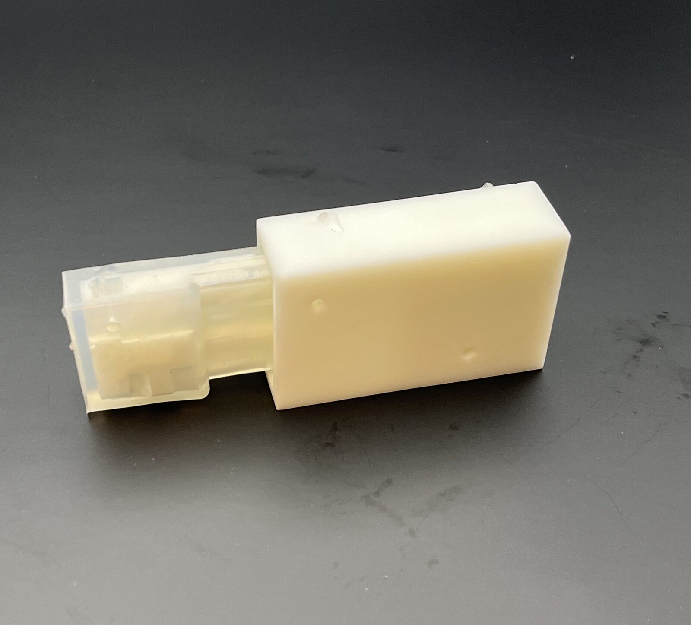{ width="30%" }

    *Removing the silicone blank from the mold (left) and the extracted blank (right).*

3. Cut an opening for the transducer connector as shown below.

    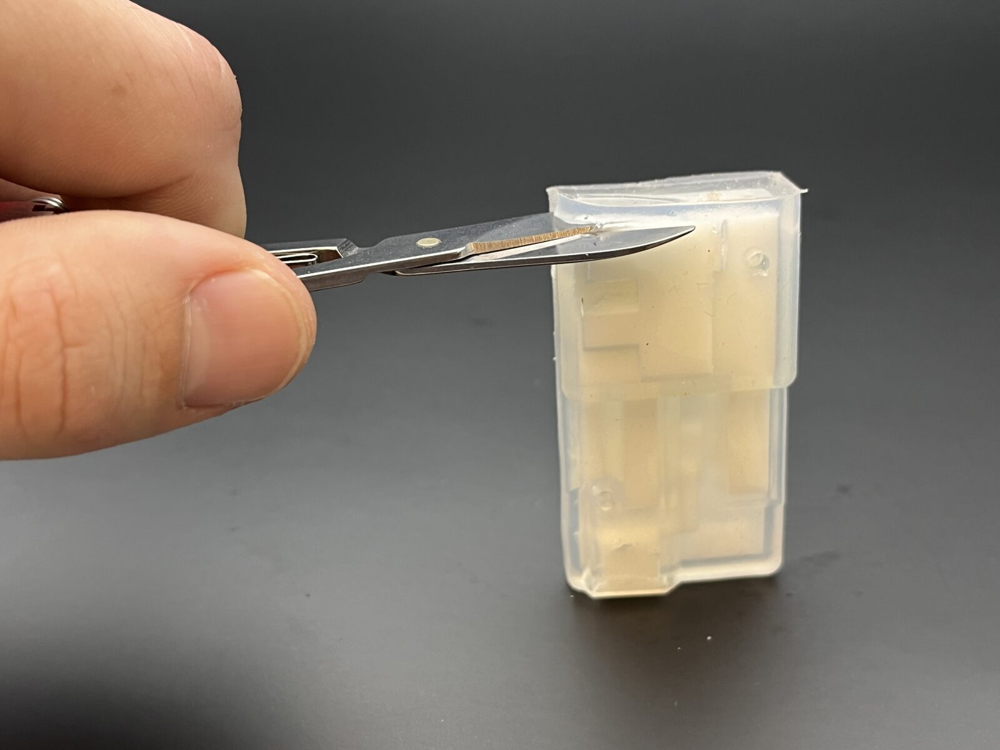{ width="47%" }
    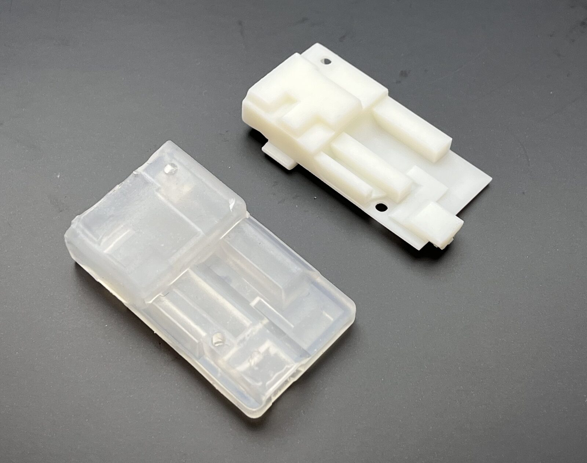{ width="45%" }

    *Cutting the transducer connector opening (left). Silicone package with the plastic insert removed (right).*

### Producing a Silicone Cap

For additional protection, consider fabricating a simple silicone cap to be inserted between the HV and acquisition PCBs near the transducer connector (right photo below). The 3D model for the mold is available in the repository (file `wulpus_silicone_cap_mold.stl`).

Follow the same production steps outlined in [Production Steps](#silicone-package-production-steps), using the figure below as a reference.

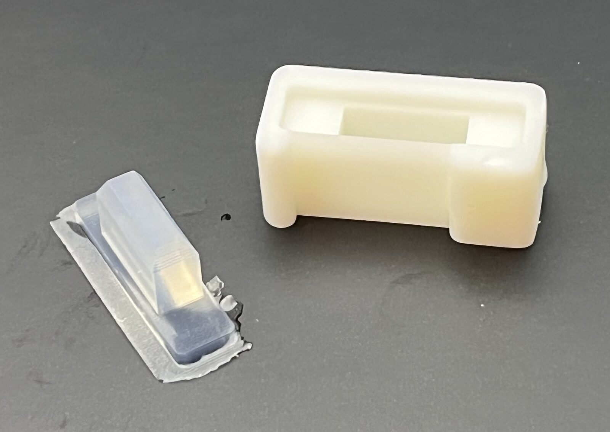{ width="45%" }
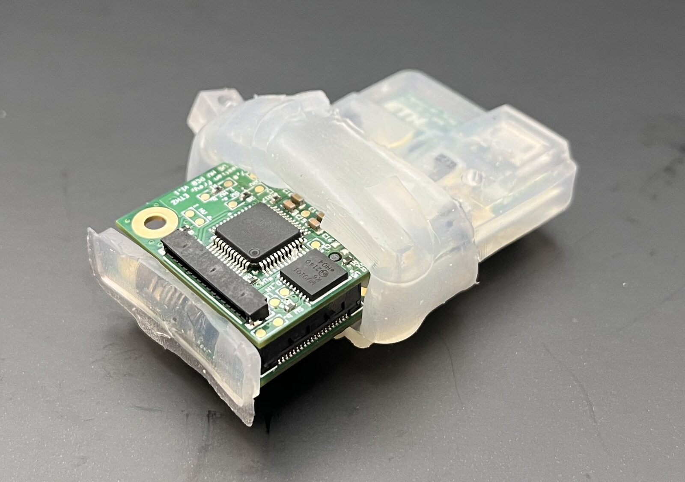{ width="45%" }

*Silicone cap for the WULPUS probe: cap and mold (left), cap inserted into WULPUS (right).*
