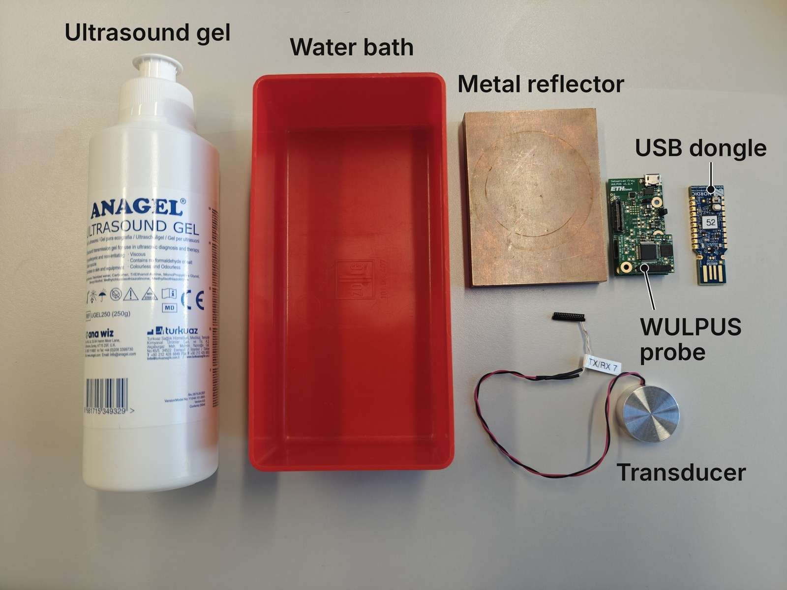
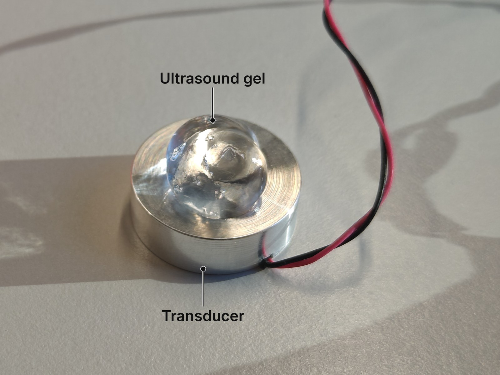
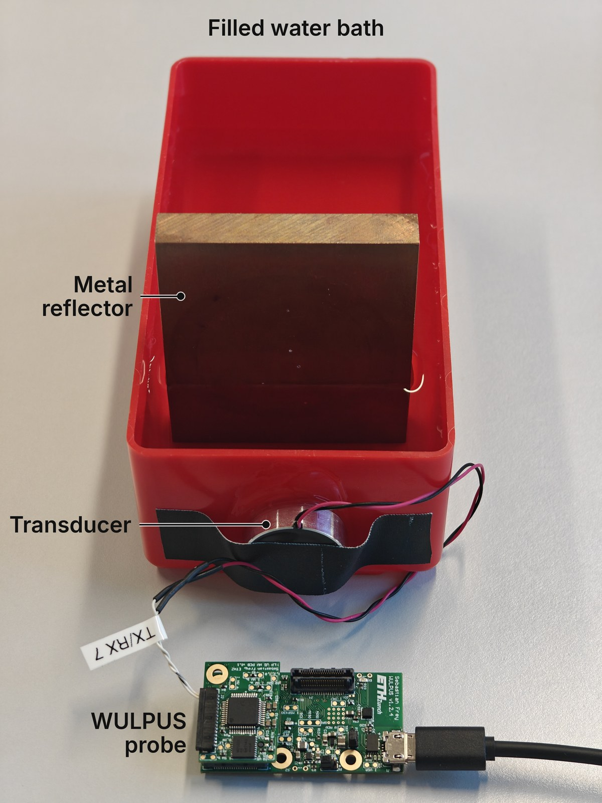
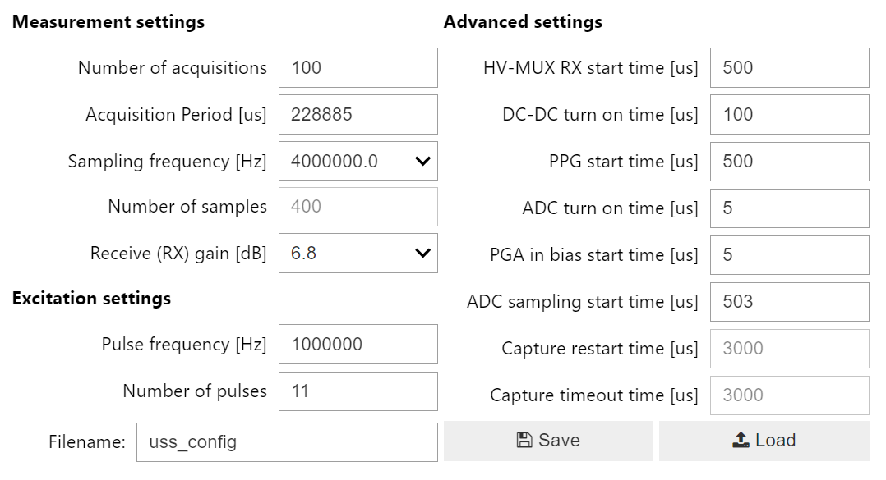
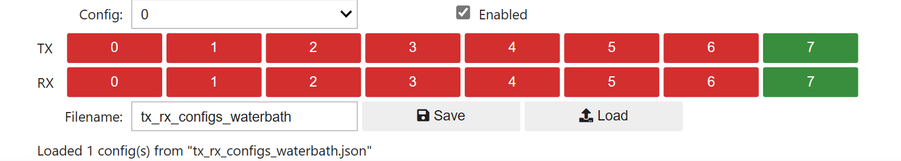
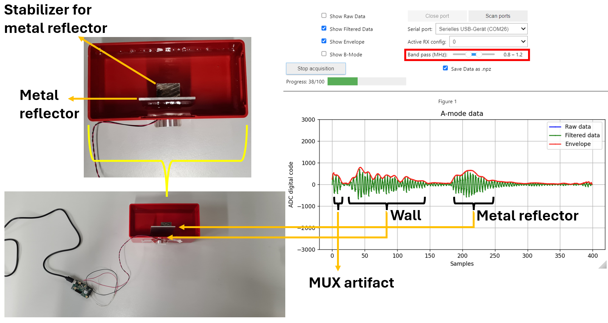

# Example experiments

This chapter describes simple example experiments a user can replicate with a WULPUS probe and with minimal equipment.

!!! warning "GUI screenshots still show the legacy Jupyter GUI"
    The water-bath setup, transducer wiring, and expected echoes are unchanged. Configuration screenshots (`gui_uss_waterbath`, RX/TX config) come from the original Jupyter notebook GUI and will be replaced with BioGUI screenshots in a follow-up.

## Water bath {#water-bath}

This simple example experiment shows how to acquire data in a water bath setup with simple metal reflectors. To replicate the results, you will need the following materials (key items are visualized below):

- Plastic water bath.
- WULPUS probe (+ micro-USB cable).
- 1 MHz ultrasound transducer (e.g. [H2KLPY11000600](https://www.digikey.ch/de/products/detail/unictron-technologies-corporation/H2KLPY11000600/9921487) from Unictron Technologies).
- WULPUS [transducer connector](https://www.digikey.com/en/products/detail/hirose-electric-co-ltd/DF52-16P-0-8C/5721348) with [pre-crimped wires](https://www.digikey.com/en/products/detail/hirose-electric-co-ltd/DF52-2832PF1571-28A9-300/11204482).
- Ultrasound Gel.
- Sticky tape.

{ width="37%" }
{ width="37%" }
{ width="21%" }

*Water bath experiment. (a) Experiment materials. (b) Coupling gel on transducer. (c) Experiment setup.*

We first solder the transducer's wires to the pre-crimped cables, assemble them with the mated mechanical connector (please wire the transducer to channel 8), and then insert the connector into the WULPUS probe. Later, we apply the gel on the transducer as shown in figure (b) and attach the transducer to the water bath using sticky tape as shown in figure (c).

Next, we plug the USB dongle into the PC. As always, a glowing green LED on the WULPUS probe indicates an established connection, and we are ready to acquire the ultrasound echo data.

Lastly, launch the GUI (see [Software requirements](how-to-get-started.md#software-requirements)). Since the default configuration does not match the 1-MHz transducer, we implement the custom settings shown below. Particularly, we reduce the ADC sampling rate to 4 MHz, change excitation frequency to 1 MHz and program 10 pulses per single excitation.

*WULPUS config for water bath experiment. ADC sampling frequency, excitation waveform and receive gain are modified to match the 1-MHz transducer.*

Since we use a single-channel transducer, we program only one TX and RX configuration of the WULPUS probe shown below. In our example, the transducer is connected to channel number 7 (remember, in the schematic this is channel 8, see [Programming TX/RX configurations via GUI](advanced-settings.md#programming-tx-rx-configurations-via-gui)).

*RX/TX configuration for water bath experiment. A single WULPUS channel (id=7) is activated for both transmit and receive.*

We then place a metal reflector into the water bath as demonstrated below and start the acquisition.

*Water well experiment. The metal plate reflector is placed approx. 1 cm away from the water bath's wall. The received signal reveals multiple parasitic reflections from the wall and target reflections from the metal plate.*

The result (we display the filtered data and envelope) is shown above. The red box denotes the frequency band the applied band-pass filter allows to pass through. As we employ a 1-MHz low-bandwidth transducer, we set the low and high cut-off frequencies to 0.8 MHz and 1.2 MHz respectively. The first two reflections correspond to the MUX artifact (see [MUX artifact mitigation](how-to-get-started.md#mux-artifact-mitigation) for further information) and the initial reflection when the acoustic wave enters the wall and the bath. The third reflection, located at sample ~220 of the received waveform, corresponds to the reflection from the metal plate. By varying the position of the metal reflector, this peak changes position accordingly.
