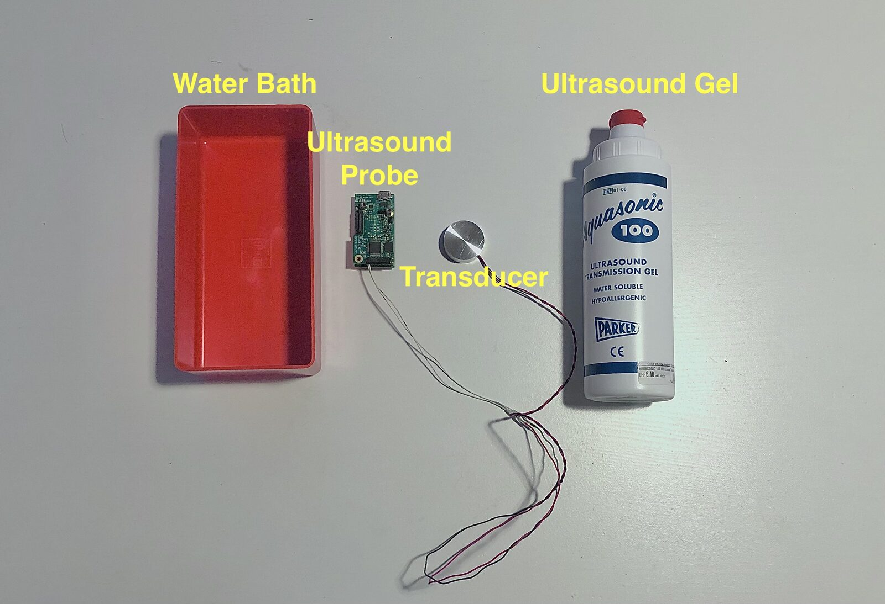
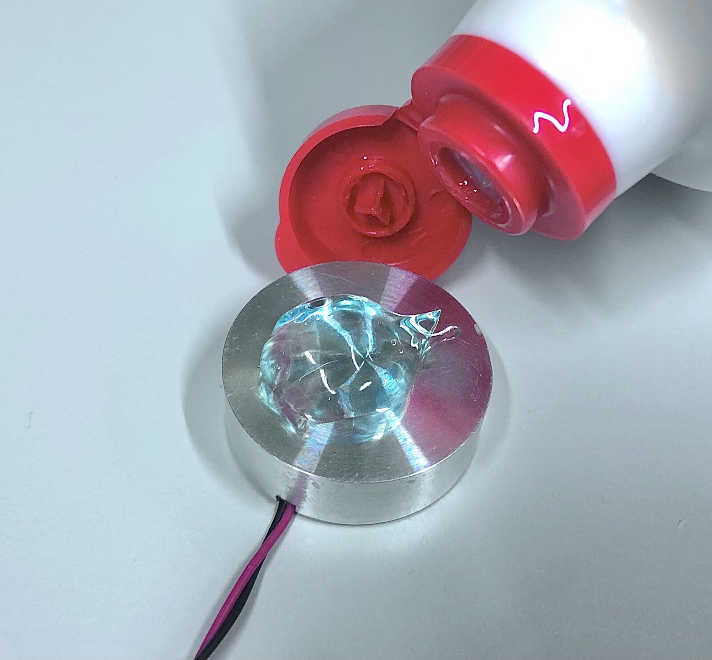
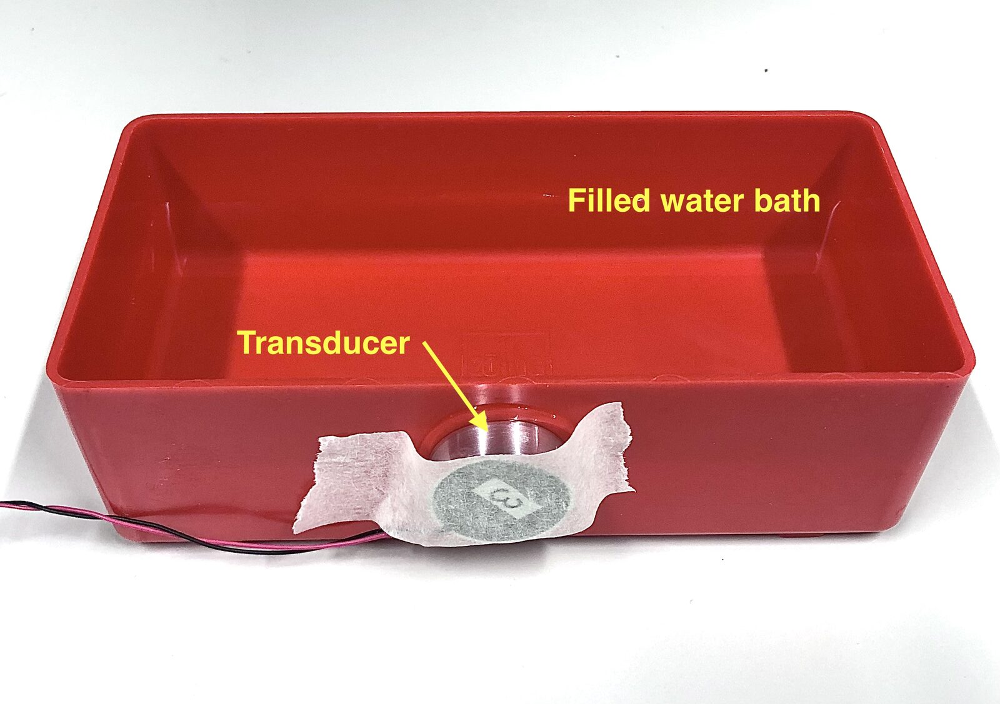
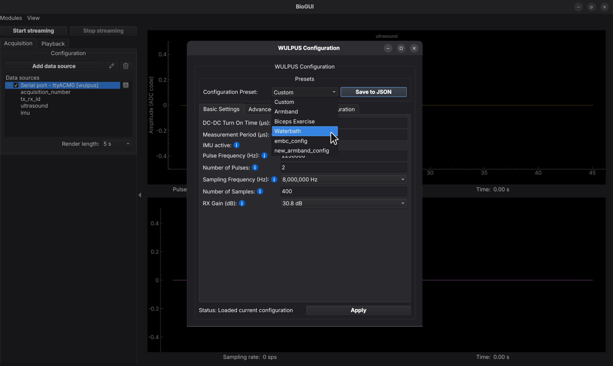
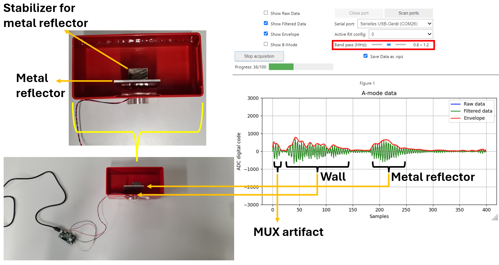

# Example experiments

This chapter describes simple example experiments a user can replicate with a WULPUS probe and with minimal equipment.

The water-bath setup uses the **Waterbath** preset in [BioGUI](https://github.com/pulp-bio/biogui). The recorded trace at the end of the chapter is the original measurement.

## Water bath {#water-bath}

This simple example experiment shows how to acquire data in a water bath setup with simple metal reflectors. To replicate the results, you will need the following materials (key items are visualized below):

- Plastic water bath.
- WULPUS probe (+ micro-USB cable).
- 1 MHz ultrasound transducer (e.g. [H2KLPY11000600](https://www.digikey.ch/de/products/detail/unictron-technologies-corporation/H2KLPY11000600/9921487) from Unictron Technologies).
- WULPUS [transducer connector](https://www.digikey.com/en/products/detail/hirose-electric-co-ltd/DF52-16P-0-8C/5721348) with [pre-crimped wires](https://www.digikey.com/en/products/detail/hirose-electric-co-ltd/DF52-2832PF1571-28A9-300/11204482).
- Ultrasound Gel.
- Sticky tape.

{ width="37%" }
{ width="37%" }
{ width="21%" }

*Water bath experiment. (a) Experiment materials. (b) Coupling gel on transducer. (c) Experiment setup.*

We first solder the transducer's wires to the pre-crimped cables, assemble them with the mated mechanical connector (please wire the transducer to channel 8), and then insert the connector into the WULPUS probe. Later, we apply the gel on the transducer as shown in figure (b) and attach the transducer to the water bath using sticky tape as shown in figure (c).

Next, we plug the USB dongle into the PC. As always, a glowing green LED on the WULPUS probe indicates an established connection, and we are ready to acquire the ultrasound echo data.

Open the WULPUS configuration (see [Programming TX/RX configurations in BioGUI](advanced-settings.md#programming-tx-rx-configurations-via-gui)). The default settings do not match the 1 MHz transducer. In **Configuration Preset**, choose **Waterbath**, then click **Apply**. You do not have to type the values in.

*Choose Waterbath from Configuration Preset. The fields behind the open list still show the previous configuration.*

The preset uses one TX/RX row. Channel 7 transmits and receives. In the schematic this is channel 8 (see [Programming TX/RX configurations in BioGUI](advanced-settings.md#programming-tx-rx-configurations-via-gui)). The full preset is:

| Label in BioGUI | Waterbath preset |
| --- | --- |
| ***Basic Settings*** | |
| DC-DC Turn On Time (µs) | 100 |
| Measurement Period (µs) | 228885 |
| Pulse Frequency (Hz) | 1000000 |
| Number of Pulses | 11 |
| Sampling Frequency (Hz) | 4000000 |
| Number of Samples | 400 |
| RX Gain (dB) | 6.8 |
| ***Advanced Timing*** | |
| HV-MUX RX Start Time (µs) | 500 |
| PPG Start Time (µs) | 500 |
| ADC Turn On Time (µs) | 5 |
| PGA In Bias Start Time (µs) | 5 |
| ADC Sampling Start Time (µs) | 503 |
| Capture Restart Time (µs) | 3000 |
| Capture Timeout (µs) | 3000 |

Place a metal reflector into the water bath as shown below, then click **Start streaming** in BioGUI. The figure is from the legacy notebook GUI. With the same filters in the plot settings, the BioGUI trace looks the same.

*Water well experiment. The metal plate reflector is placed approx. 1 cm away from the water bath's wall.*

The red box is the band-pass. For this 1 MHz transducer, set the cut-off frequencies to 0.8 MHz and 1.2 MHz when you configure the signal (see [Adding a WULPUS data source](how-to-get-started.md#adding-a-wulpus-data-source)). The first two reflections correspond to the MUX artifact (see [MUX artifact mitigation](how-to-get-started.md#mux-artifact-mitigation) for further information) and the initial reflection when the acoustic wave enters the wall and the bath. The third reflection, located at sample ~220 of the received waveform, corresponds to the reflection from the metal plate. By varying the position of the metal reflector, this peak changes position accordingly.
