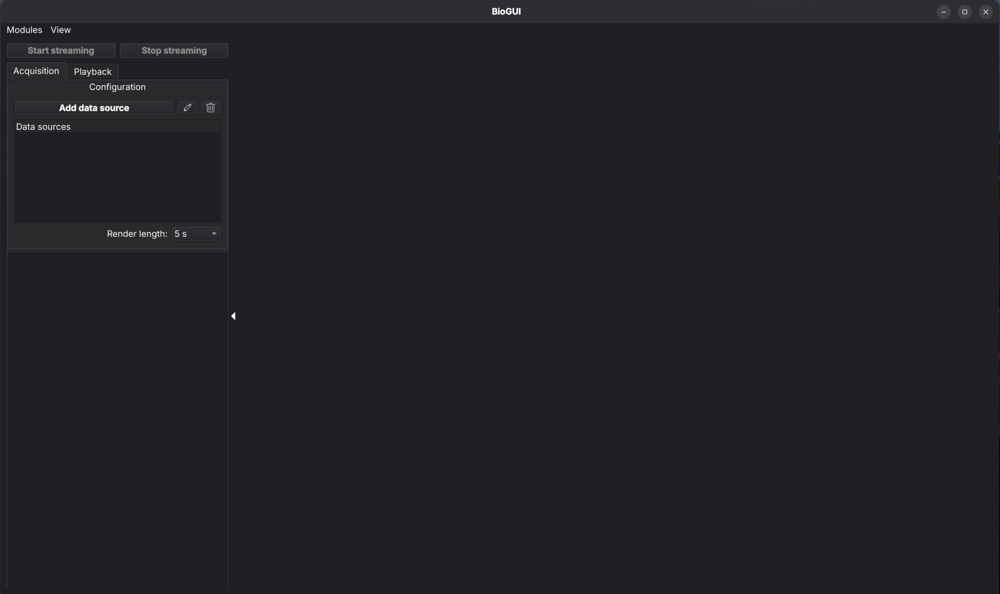
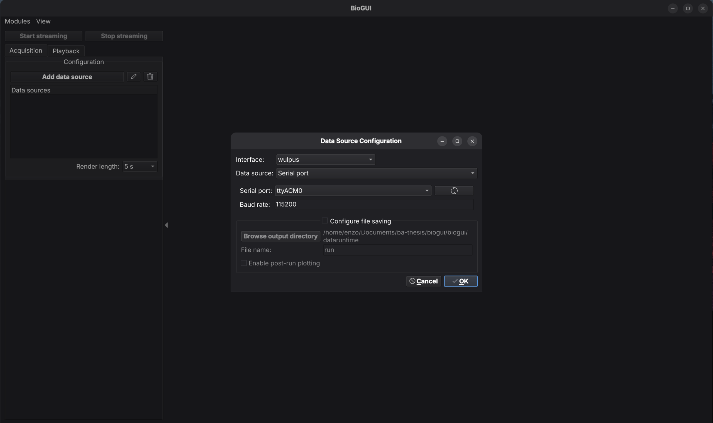
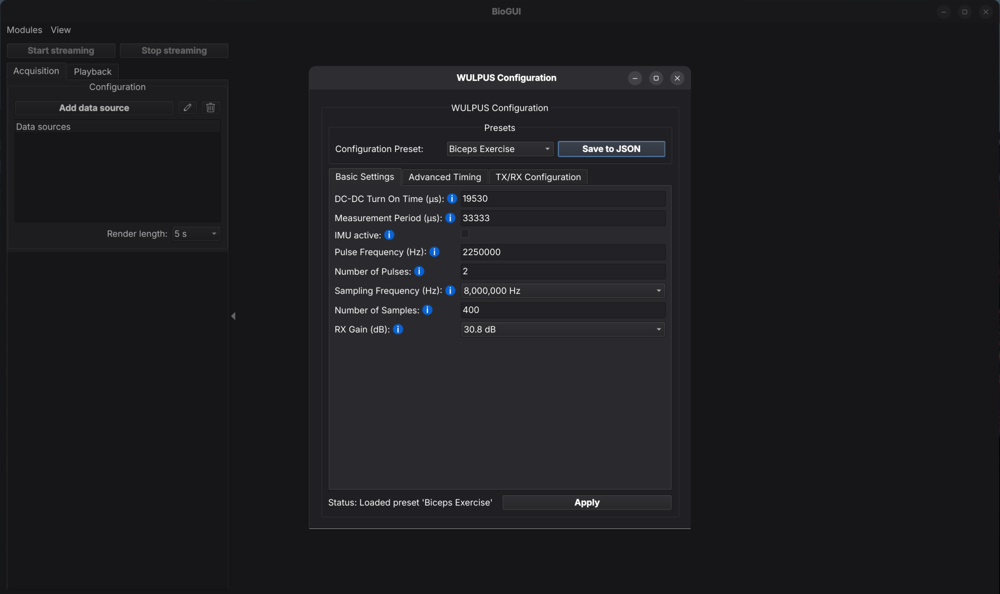
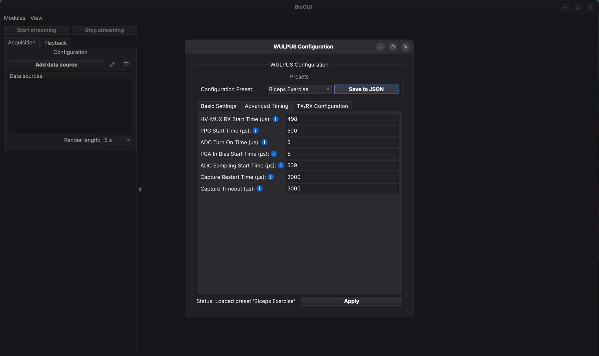
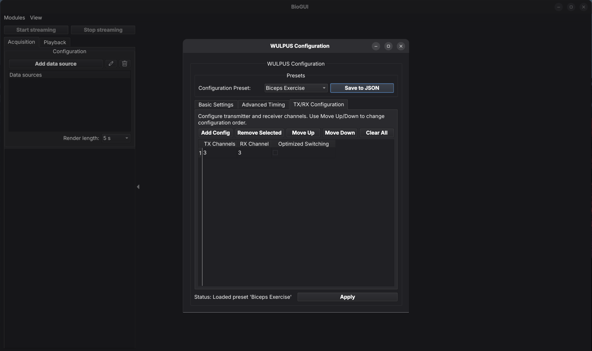
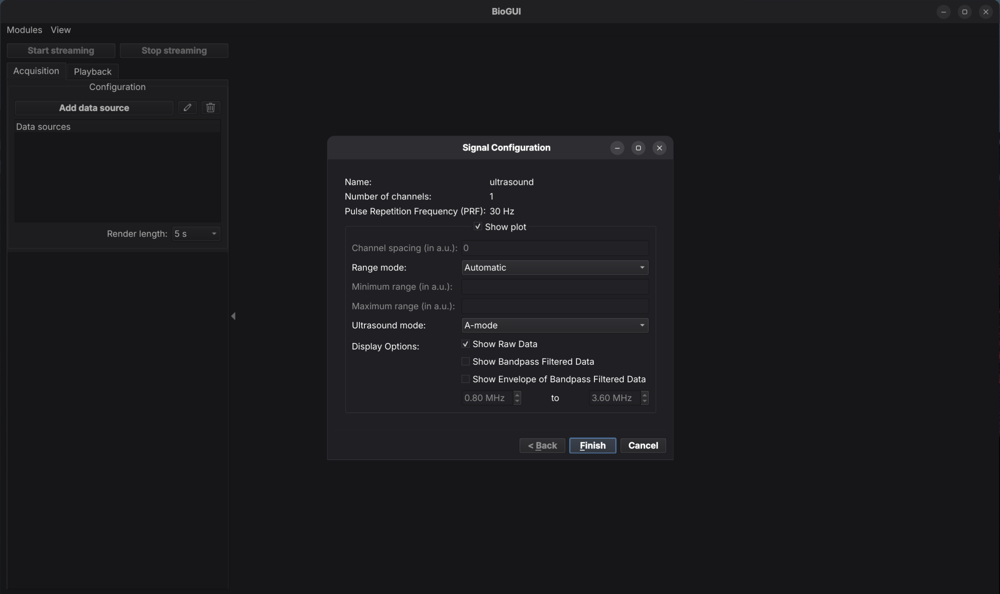
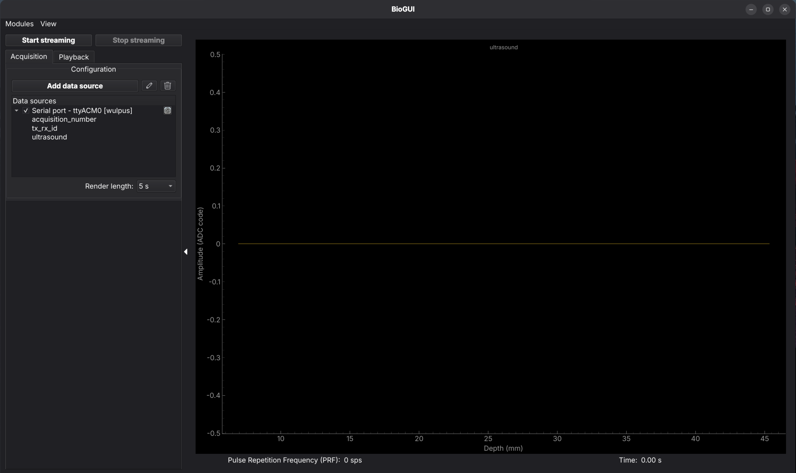
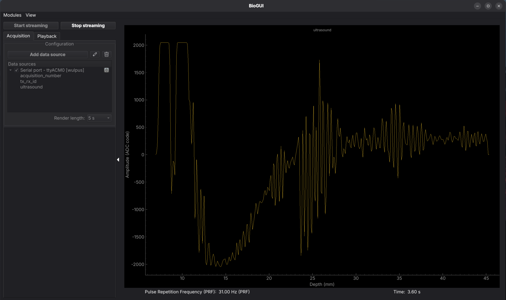

# How to use the probe?

This chapter explains the needed steps to get started with the WULPUS probe.

The first section focuses on the hardware requirements. The next sections install [BioGUI](https://github.com/pulp-bio/biogui) and walk through a first measurement. A short note points to the web GUI, which will be documented later. The Jupyter notebook interface is kept at the end as the legacy option. HV-MUX artifact mitigation is unchanged and still illustrated with the legacy GUI.

## Hardware requirements {#hardware-requirements}

To conduct US measurements with WULPUS, you will need the components listed in the following (see figure below).

1. Acquisition PCB
2. High Voltage PCB
3. Your ultrasound transducer (with compatible connector)
4. nRF USB Dongle
5. Windows (or Linux) computer/laptop with USB port
6. Power supply: USB cable/battery/lab supply

!!! note
    The HV PCB is equipped with a 16-pin **DF52-16S-0.8H** connector. To connect a custom transducer to this connector, the user should utilize a compatible **DF52-16P-0.8C** mating connector, along with pre-crimped **DF52-2832PF1571-28A9-300** cables. The pre-crimped cables should then be directly soldered to the transducer terminals.

{ width="80%" }

*Overview of the hardware components. The image of the USB Dongle is adapted from [Nordic Semiconductor](https://www.nordicsemi.com/Products/Development-hardware/nRF52840-Dongle/GetStarted).*

## Software requirements {#software-requirements}

**[BioGUI](https://github.com/pulp-bio/biogui)** is the preferred interface for general use. It is a separate repository. The WULPUS repository and its Jupyter notebook are not required to run it.

The web-based React GUI in [`sw/`](https://github.com/pulp-bio/wulpus/tree/main/sw) is mainly for NDT applications. A walkthrough will be added later. Until then, follow [`sw/README.md`](https://github.com/pulp-bio/wulpus/blob/main/sw/README.md).

### Installing BioGUI

1. Install [uv](https://docs.astral.sh/uv/getting-started/installation/).
2. Clone the BioGUI repository and open that folder:

    ```
    git clone https://github.com/pulp-bio/biogui.git
    cd biogui
    ```

3. Install the dependencies and start the application:

    ```
    uv sync
    uv run main.py
    ```

The main window opens as shown below. The screenshots in this chapter were taken on Linux. On Windows the window frame looks different. The controls are the same. Further BioGUI features (modules, playback, forwarding) are described in the [BioGUI documentation](https://pulp-bio.github.io/biogui/).



*BioGUI main window after startup.*

## Using BioGUI

### Connecting the probe

Plug the flashed USB dongle into the computer. Then power the WULPUS probe. The onboard LEDs of the dongle indicate whether the Bluetooth connection has been established (see figure below).

{ width="80%" }

*LED locations on the USB dongle and their indications. Note: after running at least one measurement, the green LED does not show the BLE connection status anymore. It just keeps the last state when the stop command arrived.*

!!! note
    If the dongle did not connect successfully to the probe, consult [Troubleshooting](troubleshooting.md).

### Adding a WULPUS data source

In the Acquisition tab, click **Add data source**.

1. Set **Interface** to `wulpus`.
2. Set **Data source** to `Serial port`.
3. Choose the dongle's serial port. It is not listed as `WULPUS_X`. Compare the list before and after plugging the dongle in. On Linux it is often a `ttyACM` device.
4. Leave **Baud rate** at `115200`, unless you have a reason to change it.
5. Saving is optional. To record, choose an output directory and a file name. You can leave this unset if you only want to look at the live plot.

    

    *Data source configuration. Interface `wulpus`, serial port, and baud rate. File saving is optional and is not enabled in this screenshot.*

6. Choosing `wulpus` opens **WULPUS Configuration** next, before the signal page. Three tabs cover the probe parameters:

    - **Basic Settings** — measurement period, pulse frequency and count, sampling frequency, number of samples, RX gain.
    - **Advanced Timing** — HV-MUX RX start time, PPG start time, ADC turn-on and sampling start, and the other acquisition timestamps.
    - **TX/RX Configuration** — which channels transmit and receive, and **Optimized Switching**.

    Load a preset or edit the fields, then click **Apply**. The same window can later be reopened from the settings icon next to the data source. What the timing values mean is described in [Configuration of Ultrasound Subsystem](advanced-settings.md#configuration-of-ultrasound-subsystem). TX/RX sets are described in [Transmit/Receive (TX/RX) configurations](advanced-settings.md#tx-rx-configurations).

    

    *Basic Settings. The preset in this screenshot is an example.*

    

    *Advanced Timing, including HV-MUX RX start time and ADC sampling start time.*

    

    *TX/RX Configuration.*

7. The signal page comes after that. For a single-channel view, set **Ultrasound mode** to `A-mode` and enable the traces you want (**Show Raw Data**, **Show Bandpass Filtered Data**, **Show Envelope of Bandpass Filtered Data**). Set the band-pass limits, then click **Finish**.

    

    *Signal configuration for an A-mode plot.*

After **Finish**, the dialog closes and the WULPUS serial port shows up under **Data sources**. Nothing is acquired yet, so the plot on the right stays empty until you start streaming.



*WULPUS source added. Streaming has not been started, so the plot is still empty.*

### Starting a measurement

Click **Start streaming**. The plot updates with the ultrasound trace. **Stop streaming** ends the acquisition.



*A-mode trace while streaming.*

### Saving a recording

Saving is optional. If you set an output directory and file name in the data source dialog before streaming, BioGUI writes the recording there. If you skip that, you still get the live plot. BioGUI does not use the old `data_x.npz` checkbox from the Jupyter notebook.

## Legacy Jupyter notebook

The notebook interface still works, but it is not the recommended setup. It lives in the WULPUS repository, not in BioGUI.

The previous user guide used Anaconda (`conda env create -f requirements.yml`). That environment file is gone. The repository now uses uv.

1. Install [uv](https://docs.astral.sh/uv/getting-started/installation/).
2. Clone the WULPUS repository: [https://github.com/pulp-bio/wulpus](https://github.com/pulp-bio/wulpus).
3. Open a terminal and go to the `sw` folder.
4. Install the Python dependencies, including Jupyter:

    ```
    uv sync --extra notebook
    ```

5. Start the notebook server:

    ```
    uv run --extra notebook jupyter notebook
    ```

6. In the browser, open `jupyter notebook (legacy)` and click **wulpus_gui.ipynb**. Follow the notebook until the main GUI is open.

The screenshots below are the original notebook GUI.

### Connecting to the probe (legacy)

After a successful connection between dongle and probe (see [Connecting the probe](#connecting-the-probe)), switch to the main GUI in the Jupyter notebook.


*The connection section of the legacy notebook GUI (highlighted in red).*

1. **Scan ports**: scan for serial devices and update the list of ports.
2. Use the **Serial port** dropdown to choose the dongle. The name is not `WULPUS_X`. Compare the list before and after plugging the dongle in.
3. **Open port**: open the selected serial device.

### Starting a measurement (legacy)

!!! note
    An **acquisition** is a fixed number of samples, spaced by the ADC sampling period. A **measurement** is a set of acquisitions.

Buttons are available only after the COM port is open.


*The measurement section of the legacy notebook GUI.*

1. Click **Start measurement**.
2. Watch the **Progress** bar.
3. Click **Stop measurement**, or wait until the programmed number of acquisitions has been collected.

!!! note
    After the measurement stops, the green LED keeps its last state. It no longer shows the connection status, and a new measurement can be started with the LED off.

### Visualizing the data in real-time


*The plotting section of the legacy notebook GUI.*

- **Show Raw Data**, **Show Filtered Data**, and **Show Envelope** toggle those traces.
- **Band pass (MHz)** sets the filter pass band.
- **Active RX config** selects which TX/RX configuration is plotted. See [Transmit/Receive (TX/RX) configurations](advanced-settings.md#tx-rx-configurations).
- **Show B-Mode** switches between single-channel A-mode and an 8-channel view. See ["B-mode" data acquisition and visualization](advanced-settings.md#b-mode).

These controls are available while the measurement is running.

### Saving and loading the data


*The saving section of the legacy notebook GUI.*

**Save data as .npz** writes the raw data next to the notebook as **data_x.npz**. `x` starts at 0 and increases if that file already exists. Enable the checkbox before the measurement. It turns off again when the measurement ends. Filtered data and the envelope are not saved. The `.npz` layout is explained in `wulpus_gui.ipynb`.

## MUX artifact mitigation {#mux-artifact-mitigation}

In order to switch between the TX and RX phases of an acquisition, the WULPUS system uses a high-voltage multiplexer. This multiplexer behaves non-ideally and introduces some charge injection during the switching event, leading to a voltage spike artifact that will be picked up by the ADC during acquisition. The more WULPUS channels are connected to receive, the larger is the artifact.

!!! warning "Screenshots show the legacy Jupyter GUI"
    The mitigation methods below are still valid. The annotated GUI screenshots come from the previous Jupyter GUI and will be updated to BioGUI later.

The figure below displays the MUX artifact during an acquisition when a 2.25 MHz linear array transducer (we use only 8 channels) was used. Eight channels are excited at transmit and the same 8 channels are activated at receive phase resulting in the largest-possible switching artifact (worst case). The signal was acquired from the vertical nylon scatters (0.1 mm diameter, 10 mm spacing) of the CIRS 040 GSE phantom. To collect the data shown here, the ultrasound-subsystem settings in figure (b) were used.

{ width="45%" }
{ width="50%" }

*High voltage multiplexer switching artifact with default settings. (a) Annotated WULPUS GUI screenshot. (b) Measurement settings.*

There are three main ways to mitigate and adjust this artifact, which will be described individually in the following subsections.

### HV MUX start time

Since a user can configure the time of switching from TX to RX state (see [Advanced Settings](advanced-settings.md#configuration-of-ultrasound-subsystem) for details), to mitigate the artifact, we can reduce the parameter **HV-MUX RX start time** from the default value of 500 µs to e.g. 494 µs. We should not make this value too low, otherwise switching will intersect with the pulsing event, and the transducers will not be excited.

{ width="45%" }
{ width="50%" }

*High voltage multiplexer switching artifact with early multiplexer switching (HV-MUX RX start time = 494 µs). (a) Annotated WULPUS GUI screenshot. (b) Measurement settings.*

The figures demonstrate that early switching shifts the artifact to the left, while the back-scattered echo signals remain on their places on the timeline.

### ADC sampling start time

Another way of adjusting the artifact is to tune the **ADC sampling start time**, such that the ADC only starts sampling after the whole or most of the artifact has passed. Below we compare the acquisitions with two different ADC sample start timings, with the default and with a delayed start.

{ width="45%" }
{ width="50%" }

*High voltage multiplexer switching artifact with early multiplexer switching and delayed ADC sampling start (ADC sampling start time = 509 µs). (a) Annotated WULPUS GUI screenshot. (b) Measurement settings.*

The starting time is set to 509 µs. As the **ADC sampling start time** is set to a later time, the MUX artifact moves to the left. This method doesn't reduce the dimensions of the artifact (duration or amplitude), but tries to reduce the space the artifact takes up in the number of samples we set up. The downside is that if important data were overlaid over the artifact and we removed the artifact entirely by starting the ADC even later, we may omit the important data. This would e.g. be the case if we are measuring shallow arteries, where the first wall has reflections which lie in the duration of the artifact.

### Switching optimization

The other method of reducing the effect of the artifact is by actually trying to reduce the dimensions of the artifact.

Since the cause of the artifact is the switching, we have to work on it. The simplest idea may be to reduce the amount of times we switch the channels of the multiplexer by analyzing the sets of transmitting/receiving channels and their intersections. This is what we are trying to do with the **Optimized switching** method of the RX/TX config GUI (see figure below).


*Location of the optimized switching choice in the RX/TX configs GUI.*

!!! note
    The RX/TX configuration GUI and its functions are discussed in detail in [Programming TX/RX configurations via GUI](advanced-settings.md#programming-tx-rx-configurations-via-gui).

Through a rather simple algorithm, WULPUS analyzes the configuration sets for TX/RX channels, and tries to pre-configure the states of the switches, so that the amount of switching during a transition from transmit to receive is minimized. The figure below shows an example MUX artifact with optimized switching enabled.

{ width="45%" }
{ width="50%" }

*High voltage multiplexer switching artifact with all previous settings and enabled Optimize Switching option. (a) Annotated WULPUS GUI screenshot. (b) Measurement settings.*

As we can see, employing an algorithm for switching optimization further reduces the artifact. At this point, we can safely increase the PGA receive gain to amplify the echo signal. The figure below demonstrates the amplified echoes obtained under the cumulative acquisition settings. Although the artifact is still present in the raw data, the band-pass filtered signal shows four target echoes with high signal to noise ratio.

{ width="45%" }
{ width="50%" }

*High voltage multiplexer switching artifact with all previous settings, enabled Optimize Switching option and increased receive gain (18.2 dB). (a) Annotated WULPUS GUI screenshot. (b) Measurement settings.*

Through an employment and combination of the described methods, the switching artifact of the HV multiplexer can be greatly reduced, allowing for accurate data collection.
