# How to use the probe?

This chapter explains the needed steps to get started with the WULPUS probe.

The first section focuses on the hardware requirements and describes the equipment you need to take the first measurements. The second section discusses necessary software installations and the WULPUS graphical user interface (GUI). Later sections cover a test measurement and HV-MUX artifact mitigation.

## Hardware requirements {#hardware-requirements}

To conduct US measurements with WULPUS, you will need the components listed in the following (see figure below).

1. Acquisition PCB
2. High Voltage PCB
3. Your ultrasound transducer (with compatible connector)
4. nRF USB Dongle
5. Windows (or Linux) computer/laptop with USB port
6. Power supply: USB cable/battery/lab supply

!!! note
    The HV PCB is equipped with a 16-pin **DF52-16S-0.8H** connector. To connect a custom transducer to this connector, the user should utilize a compatible **DF52-16P-0.8C** mating connector, along with pre-crimped **DF52-2832PF1571-28A9-300** cables. The pre-crimped cables should then be directly soldered to the transducer terminals.

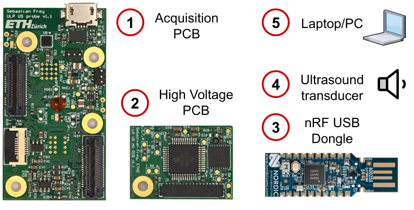{ width="80%" }

*Overview of the hardware components. The image of the USB Dongle is adapted from [Nordic Semiconductor](https://www.nordicsemi.com/Products/Development-hardware/nRF52840-Dongle/GetStarted).*

## Software requirements {#software-requirements}

!!! warning "This walkthrough describes the legacy Jupyter GUI"
    Screenshots and steps below are from the original Jupyter notebook GUI (`wulpus_gui.ipynb`). They still work, but this is **not** the recommended setup anymore. A follow-up will document:

    - **[BioGUI](https://github.com/pulp-bio/biogui)** — preferred / default for general use and HMI. See the [BioGUI documentation](https://pulp-bio.github.io/biogui/).
    - **Web-based React GUI** — mainly for NDT applications and acquisition sequences. Setup: [`sw/README.md`](https://github.com/pulp-bio/wulpus/blob/main/sw/README.md).

The Jupyter GUI uses the following key technologies (among others):

1. **Python** 3.9–3.11
2. Interactive **Jupyter Notebook**
3. **Matplotlib** visualization library
4. **IPyWidgets** / **ipympl** backend for interactive Matplotlib features and widgets
5. **Pyserial** for serial communication
6. **Scipy** for data processing
7. **Multithreading**

The following guides the user step by step through the installation. The previous user guide used Anaconda (`conda env create -f requirements.yml`). That environment file is gone; the repository now uses [uv](https://docs.astral.sh/uv/getting-started/installation/).

1. Install [uv](https://docs.astral.sh/uv/getting-started/installation/).
2. Download the WULPUS GitHub repository: [https://github.com/pulp-bio/wulpus](https://github.com/pulp-bio/wulpus).
3. Open a terminal and navigate to the `sw` folder.
4. Install the Python dependencies, including Jupyter:

    ```
    uv sync --extra notebook
    ```

5. Launch the Jupyter notebook server:

    ```
    uv run --extra notebook jupyter notebook
    ```

6. The command above opens a webpage. Navigate to `jupyter notebook (legacy)` and click on **wulpus_gui.ipynb**. Now we are all set up to make a test measurement, which will be described in the next section.

## GUI Overview

Once a user has a WULPUS device and installed all the software dependencies, they are ready for running the first measurement. In this section, we will give a short overview of the main GUI. To get started, open the example Jupyter notebook called **wulpus_gui.ipynb** (described above) and follow the instructions in the notebook until you launch the main GUI.

### Connecting to the probe

Before proceeding, plug the flashed USB dongle into the computer you want to use for the data acquisition. Then, power the WULPUS probe. The onboard LEDs of the dongle indicate whether the Bluetooth connection has been successfully established or not (see figure below for details).

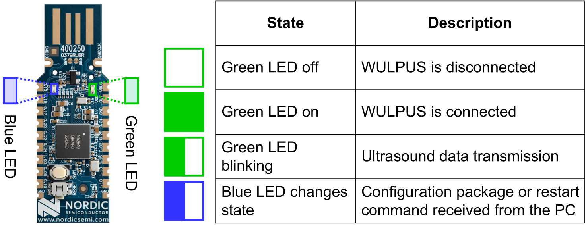{ width="80%" }

*LED locations on the USB dongle and their indications. Note: after running at least one measurement, the green LED does not show the BLE connection status anymore. It just keeps the last state when the stop command arrived.*

!!! note
    If the dongle did not connect successfully to the probe, consult [Troubleshooting](troubleshooting.md).

After establishing a successful connection between the dongle and the probe, switch to the main GUI in the Jupyter notebook.

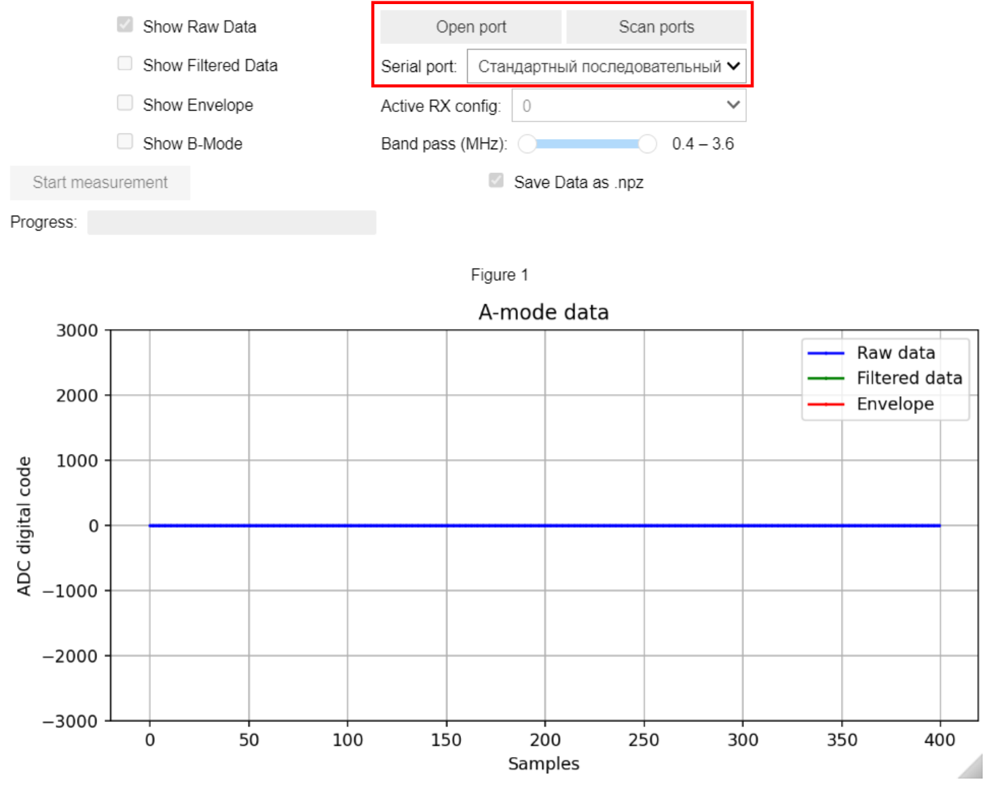

*The connection section of the main GUI (highlighted in red).*

The figure above shows a screenshot of the GUI in its initial state and highlights the toolbar for connecting to the USB dongle. With these controls, do the following:

1. **Scan ports**: scan for serial devices available in the operating system and update the internal list of ports.
2. Use the **Serial port** dropdown to choose your device from the list.

    !!! note
        The name of the dongle in the list isn't shown as "WULPUS_X" directly. You need to figure out the right port name e.g. by comparing the list once before and after plugging the dongle in.

3. **Open port**: open a connection to the selected serial device (the USB dongle).

After opening the correct COM port, the GUI is successfully connected to the dongle, and the measurement can be triggered.

### Starting a measurement

!!! note
    From now on, we call **acquisition** a certain number of samples with a period between them determined by the ADC sampling frequency. Moreover, we refer to a set of acquisitions as **measurement**.

In this section of the main GUI (highlighted in the figure below), a user can manage the measurement. Corresponding control buttons are available only when the dongle is connected (COM port is selected and opened).

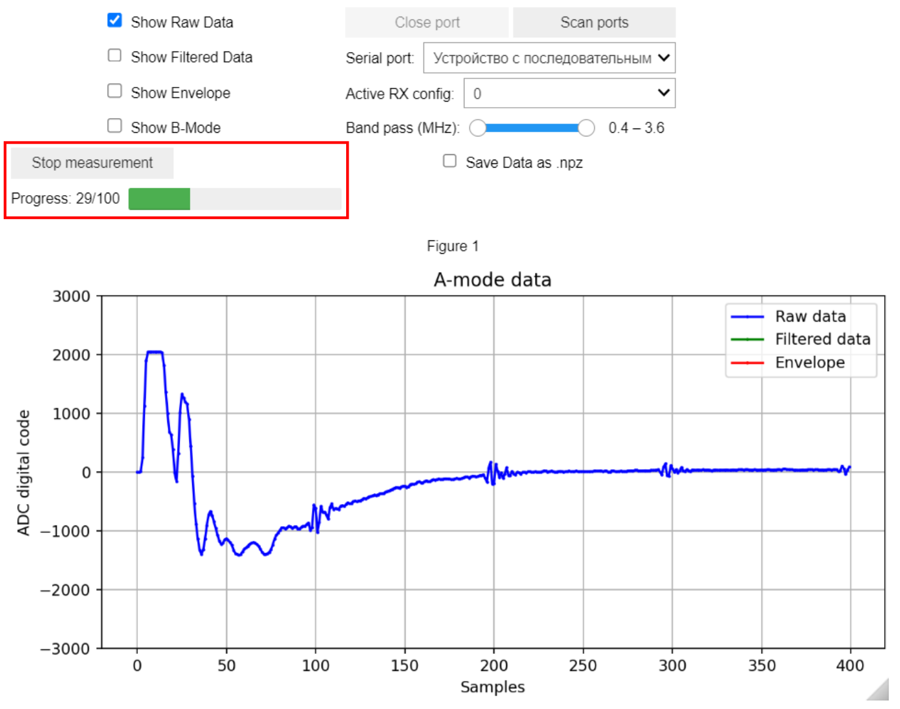

*The measurement section of the main GUI. The measurement captures four vertical scatters (10 mm spacing) of the CIRS 040 GSE phantom.*

To proceed with the measurement, follow the steps below:

1. Start the measurement by clicking on the **Start measurement** button.
2. Observe the progress of the current measurement in the **Progress** bar.
3. Either stop the measurement in the middle of the process by clicking on the **Stop measurement** button or wait until the programmed number of acquisitions is collected. In the last case, the measurement will be stopped automatically.

!!! note
    After stopping the measurement (by pressing a button or automatically), the green LED will normally preserve its last state (on or off). At this point, the green LED does not represent connection status (like after a power up), and a user can start a new measurement safely even if the green LED is off.

!!! note
    The figure above also shows the real raw ultrasound data acquired from a CIRS 040 GSE phantom with a 2.25 MHz linear array transducer. To get more information about connecting a custom transducer to the WULPUS probe and configuring the custom measurement, refer to [Water bath](example-measurements.md#water-bath).

### Visualizing the data in real-time

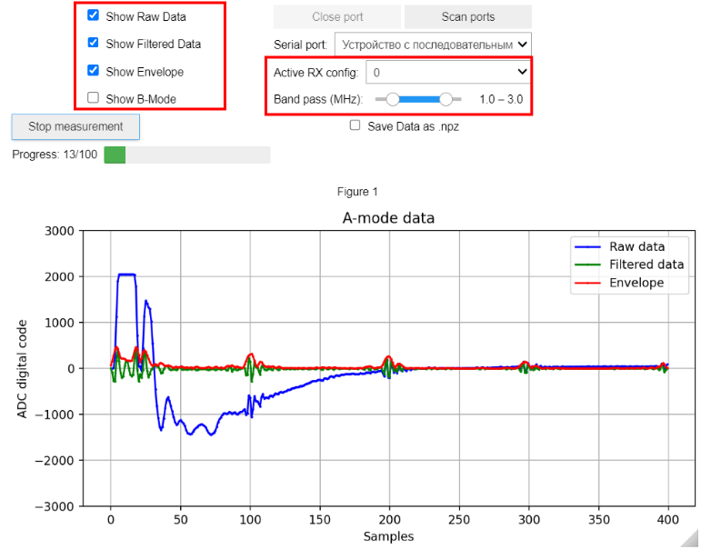

*The plotting sections of the main GUI. The measurement captures four vertical scatters (10 mm spacing) of the CIRS 040 GSE phantom.*

In the next section of the main GUI, shown above, a user can configure the settings of real-time data visualization. The following functionality is available:

- **Show Raw Data** checkbox toggles visibility of the raw acquired echo signal.
- **Show Filtered Data** checkbox toggles visibility of the band-pass filtered echo signal.
- **Band pass (MHz)** slider adjusts the pass band of the filter.
- **Show Envelope** checkbox toggles visibility of the envelope extracted from the filtered signal.
- If multiple TX/RX configs are active, the one to be plotted can be chosen with the **Active RX config** dropdown menu.

    !!! note
        See [Transmit/Receive (TX/RX) configurations](advanced-settings.md#tx-rx-configurations) for more details about RX/TX configurations.

- There are two different plotting methods: single-channel A-mode and 8-channel B-mode. This can be toggled with the **Show B-Mode** checkbox.

    !!! note
        See ["B-mode" data acquisition and visualization](advanced-settings.md#b-mode) for more details about the B-mode option.

The options described above can be accessed while the measurement is running. When the measurement is stopped, visualization settings cannot be changed.

### Saving and loading the data

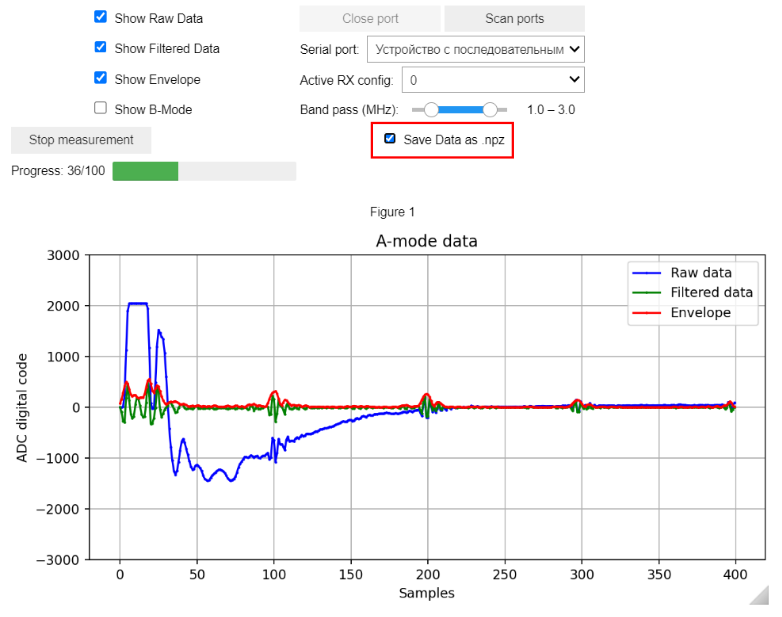

*The saving section of the main GUI.*

With the help of the dedicated checkbox (**Save data as .npz**, see figure above), a user can instruct the GUI to save the raw data to a file after completion of the measurement. The file will be located in the same directory as the Jupyter notebook and named **data_x.npz** where **x** starts from 0 and automatically gets incremented. If there is already a file with the name **data_x.npz**, the GUI will increment **x** until there is no file with this name and then save the data. Please remember to activate the checkbox in advance, since it will be automatically disabled after the measurement completed (stopped or finished automatically).

!!! note
    Only the raw ultrasound data will be saved. The filtered data and envelope are not saved.

The concept of the **.npz** files and their content is explained in the example Jupyter notebook. Please refer to the repository.
## MUX artifact mitigation {#mux-artifact-mitigation}

In order to switch between the TX and RX phases of an acquisition, the WULPUS system uses a high-voltage multiplexer. This multiplexer behaves non-ideally and introduces some charge injection during the switching event, leading to a voltage spike artifact that will be picked up by the ADC during acquisition. The more WULPUS channels are connected to receive, the larger is the artifact.

!!! warning "Screenshots show the legacy Jupyter GUI"
    The mitigation methods below are still valid. The annotated GUI screenshots come from the previous Jupyter GUI and will be updated to BioGUI later.

The figure below displays the MUX artifact during an acquisition when a 2.25 MHz linear array transducer (we use only 8 channels) was used. Eight channels are excited at transmit and the same 8 channels are activated at receive phase resulting in the largest-possible switching artifact (worst case). The signal was acquired from the vertical nylon scatters (0.1 mm diameter, 10 mm spacing) of the CIRS 040 GSE phantom. To collect the data shown here, the ultrasound-subsystem settings in figure (b) were used.

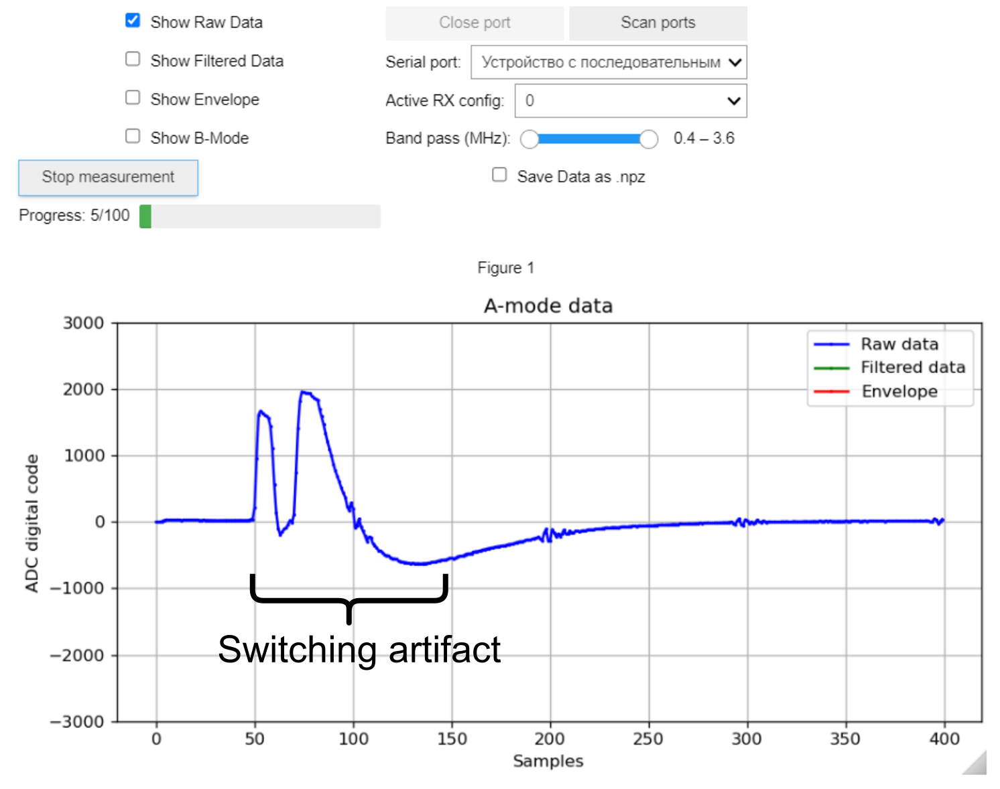{ width="45%" }
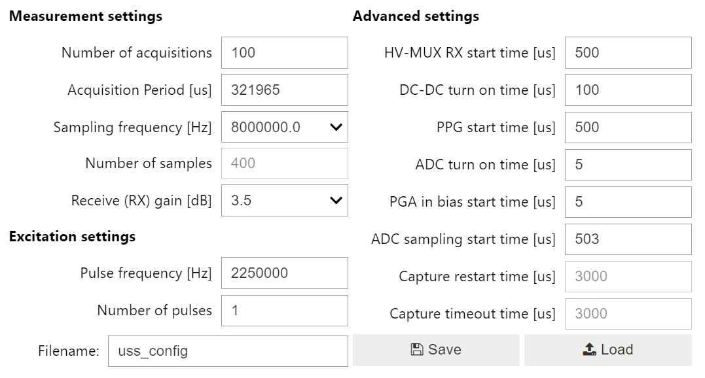{ width="50%" }

*High voltage multiplexer switching artifact with default settings. (a) Annotated WULPUS GUI screenshot. (b) Measurement settings.*

There are three main ways to mitigate and adjust this artifact, which will be described individually in the following subsections.

### HV MUX start time

Since a user can configure the time of switching from TX to RX state (see [Advanced Settings](advanced-settings.md#configuration-of-ultrasound-subsystem) for details), to mitigate the artifact, we can reduce the parameter **HV-MUX RX start time** from the default value of 500 µs to e.g. 494 µs. We should not make this value too low, otherwise switching will intersect with the pulsing event, and the transducers will not be excited.

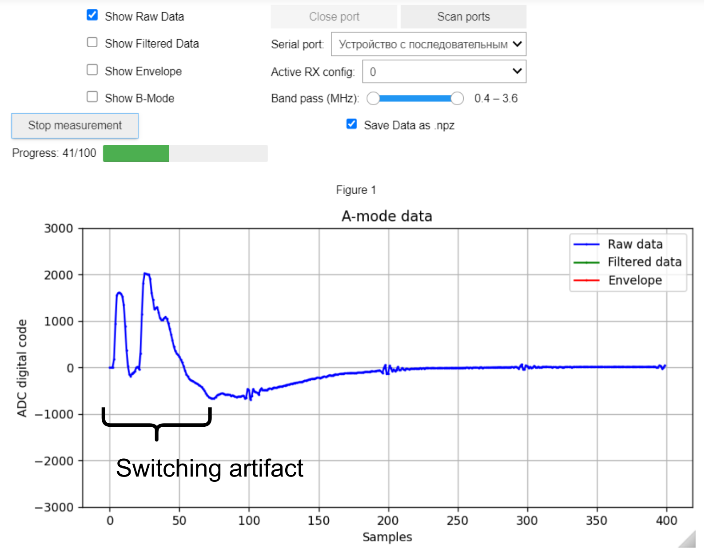{ width="45%" }
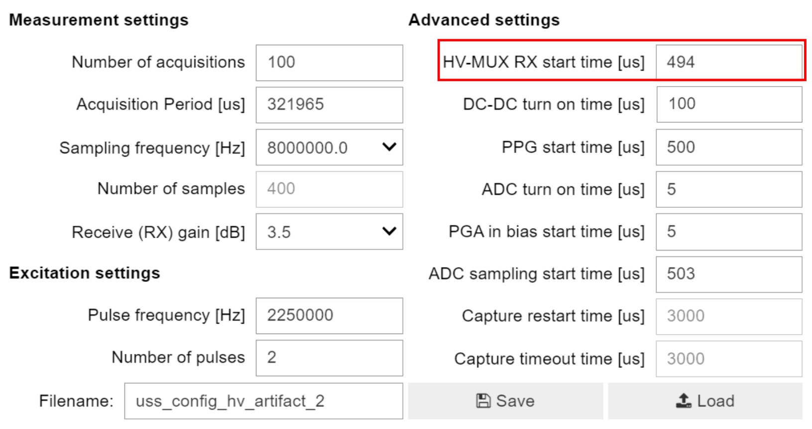{ width="50%" }

*High voltage multiplexer switching artifact with early multiplexer switching (HV-MUX RX start time = 494 µs). (a) Annotated WULPUS GUI screenshot. (b) Measurement settings.*

The figures demonstrate that early switching shifts the artifact to the left, while the back-scattered echo signals remain on their places on the timeline.

### ADC sampling start time

Another way of adjusting the artifact is to tune the **ADC sampling start time**, such that the ADC only starts sampling after the whole or most of the artifact has passed. Below we compare the acquisitions with two different ADC sample start timings, with the default and with a delayed start.

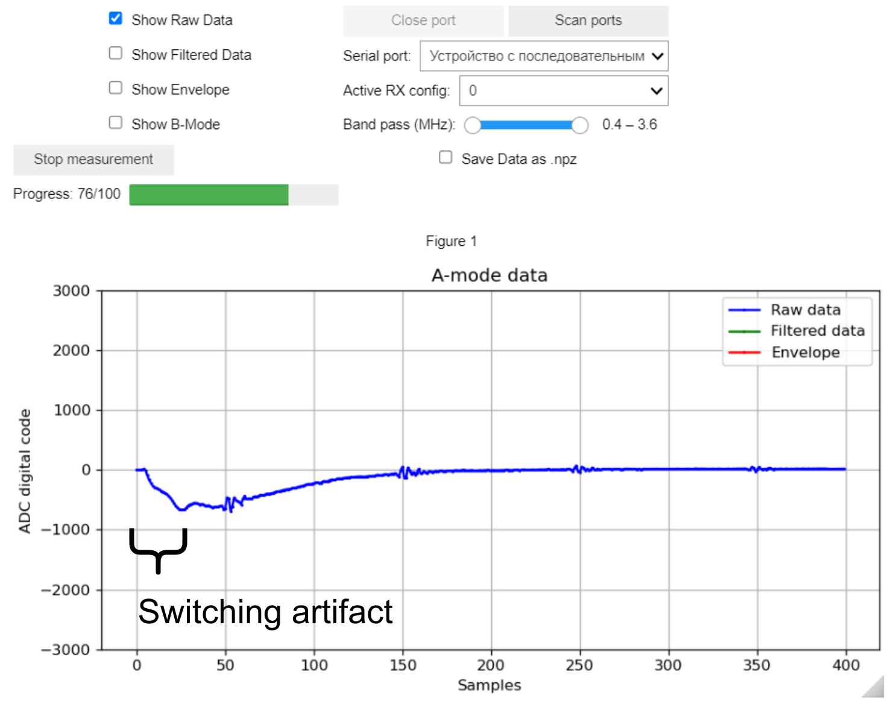{ width="45%" }
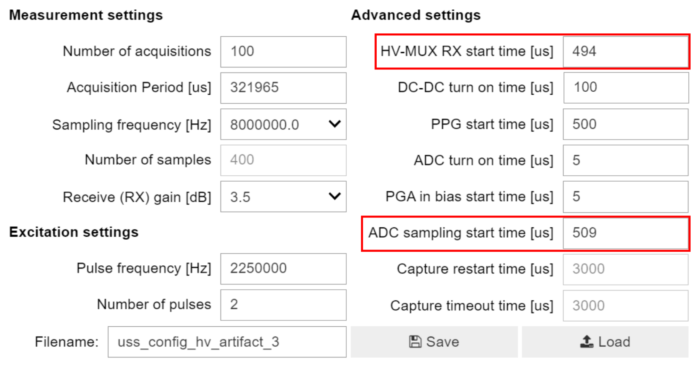{ width="50%" }

*High voltage multiplexer switching artifact with early multiplexer switching and delayed ADC sampling start (ADC sampling start time = 509 µs). (a) Annotated WULPUS GUI screenshot. (b) Measurement settings.*

The starting time is set to 509 µs. As the **ADC sampling start time** is set to a later time, the MUX artifact moves to the left. This method doesn't reduce the dimensions of the artifact (duration or amplitude), but tries to reduce the space the artifact takes up in the number of samples we set up. The downside is that if important data were overlaid over the artifact and we removed the artifact entirely by starting the ADC even later, we may omit the important data. This would e.g. be the case if we are measuring shallow arteries, where the first wall has reflections which lie in the duration of the artifact.

### Switching optimization

The other method of reducing the effect of the artifact is by actually trying to reduce the dimensions of the artifact.

Since the cause of the artifact is the switching, we have to work on it. The simplest idea may be to reduce the amount of times we switch the channels of the multiplexer by analyzing the sets of transmitting/receiving channels and their intersections. This is what we are trying to do with the **Optimized switching** method of the RX/TX config GUI (see figure below).

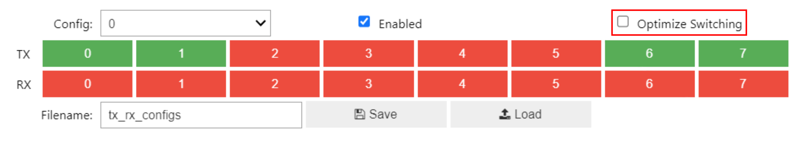

*Location of the optimized switching choice in the RX/TX configs GUI.*

!!! note
    The RX/TX configuration GUI and its functions are discussed in detail in [Programming TX/RX configurations via GUI](advanced-settings.md#programming-tx-rx-configurations-via-gui).

Through a rather simple algorithm, WULPUS analyzes the configuration sets for TX/RX channels, and tries to pre-configure the states of the switches, so that the amount of switching during a transition from transmit to receive is minimized. The figure below shows an example MUX artifact with optimized switching enabled.

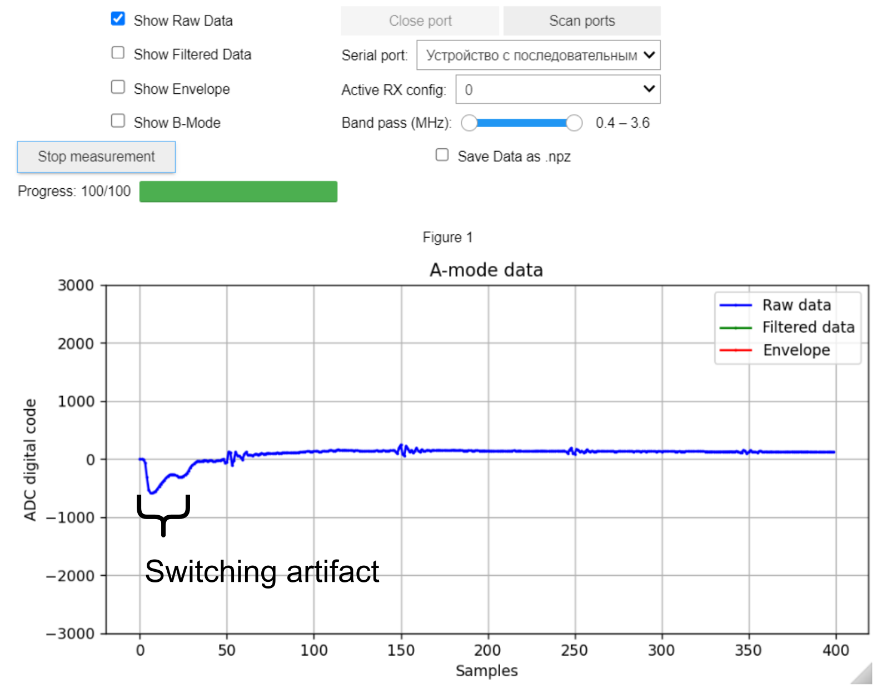{ width="45%" }
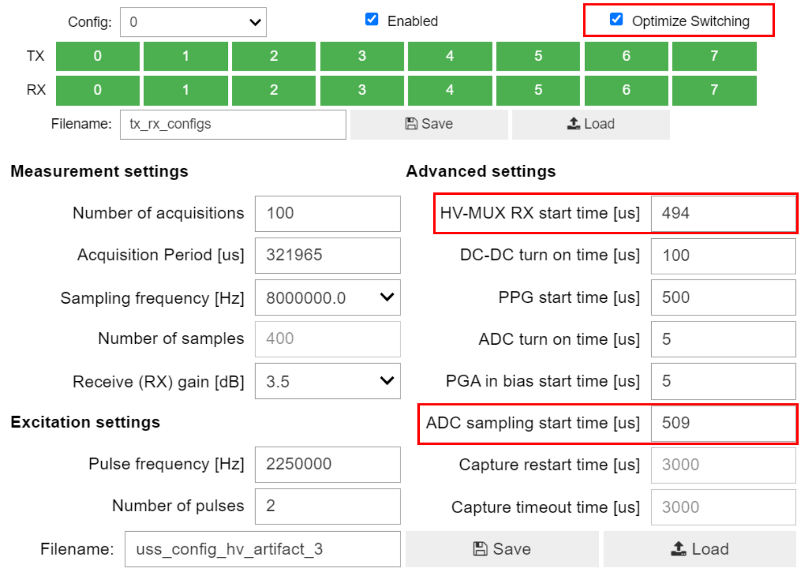{ width="50%" }

*High voltage multiplexer switching artifact with all previous settings and enabled Optimize Switching option. (a) Annotated WULPUS GUI screenshot. (b) Measurement settings.*

As we can see, employing an algorithm for switching optimization further reduces the artifact. At this point, we can safely increase the PGA receive gain to amplify the echo signal. The figure below demonstrates the amplified echoes obtained under the cumulative acquisition settings. Although the artifact is still present in the raw data, the band-pass filtered signal shows four target echoes with high signal to noise ratio.

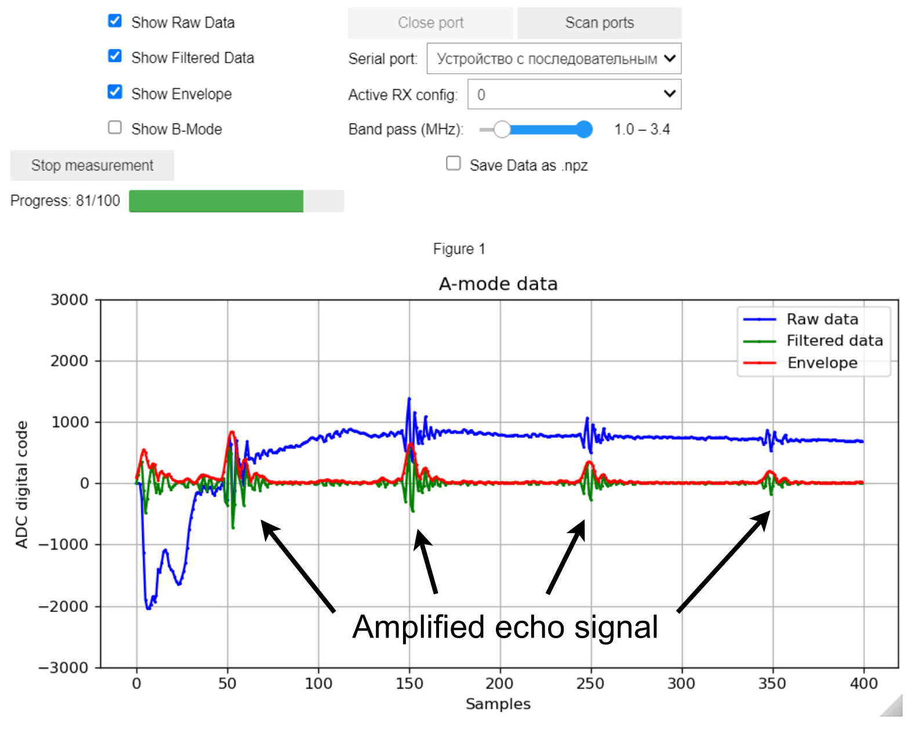{ width="45%" }
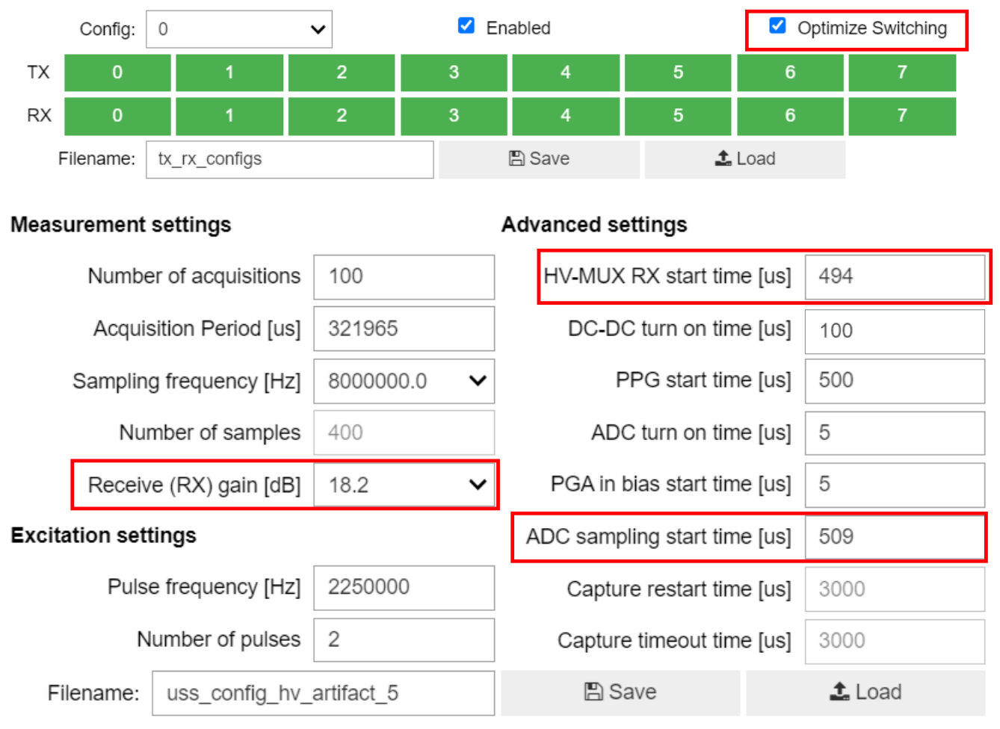{ width="50%" }

*High voltage multiplexer switching artifact with all previous settings, enabled Optimize Switching option and increased receive gain (18.2 dB). (a) Annotated WULPUS GUI screenshot. (b) Measurement settings.*

Through an employment and combination of the described methods, the switching artifact of the HV multiplexer can be greatly reduced, allowing for accurate data collection.
