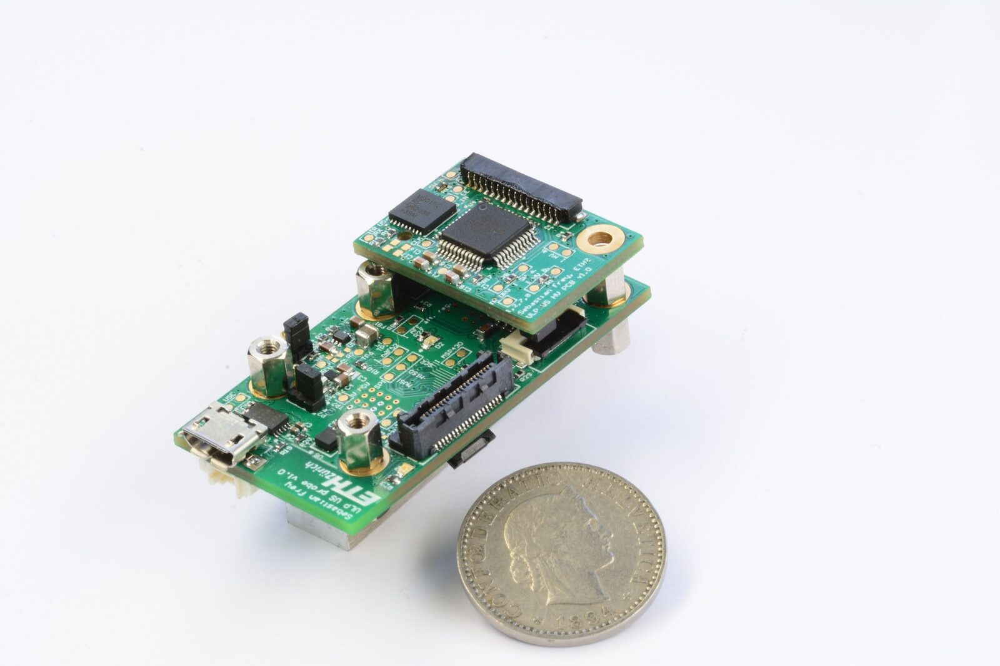
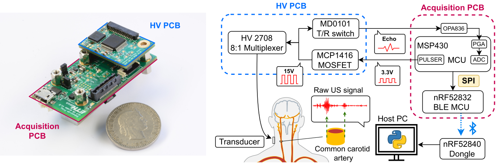
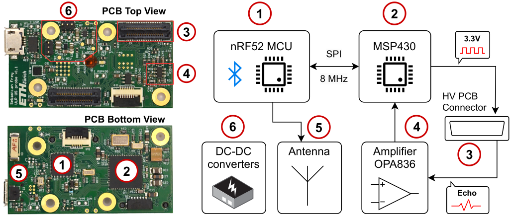
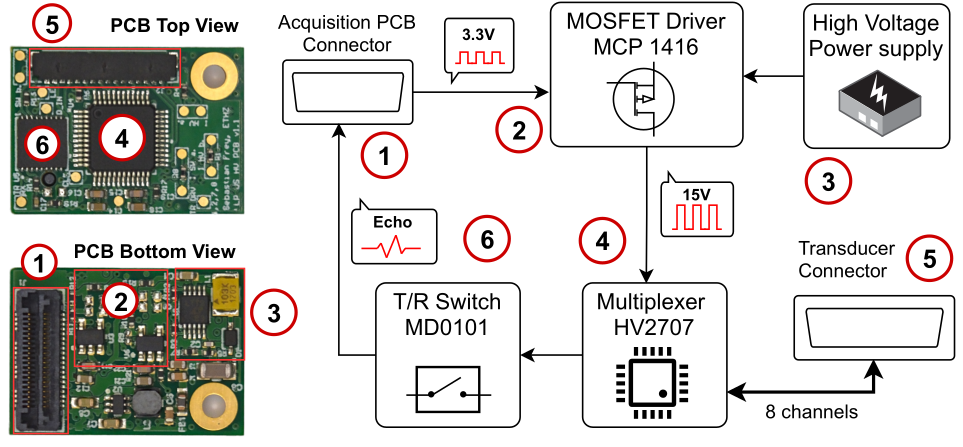
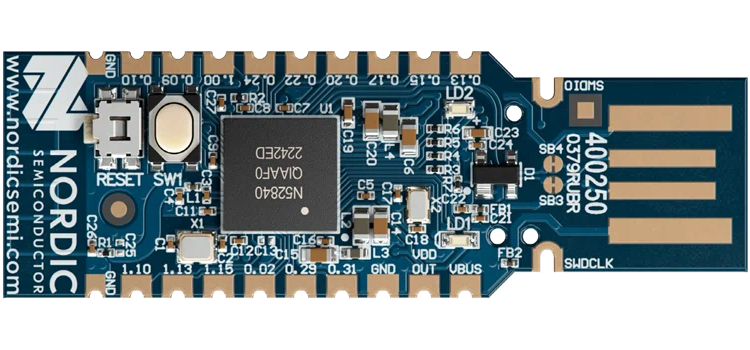

# System Overview

{ width="80%" }

*The WULPUS system compared to a coin.*

## What is the WULPUS probe?

The Wearable Ultra Low-Power Ultrasound (WULPUS) probe is the first open-source ultrasound platform developed for wearable applications. WULPUS was first presented at IUS 2022 [[1]](#ref-1), demonstrating real-time acoustical monitoring of the common carotid artery and gastrocnemius muscle. Further developments presented a WULPUS-based armband for hand gesture recognition [[2]](#ref-2), [[3]](#ref-3), an improved armband for hand movement regression [[4]](#ref-4), and a chest patch for complete cardiorespiratory monitoring [[5]](#ref-5) (i.e., simultaneous respiration and heart rate extraction). The prime objective of the WULPUS platform is to provide a compact, energy-efficient, and wireless solution for ultrasound on-body sensing.

Unlike other sensing technologies for deep tissue inspection, ultrasound is non-ionizing, making it safe for regular use. It also offers high temporal resolution and is cost-effective. The WULPUS probe amplifies these benefits by being wearable and energy-efficient, aiming at multi-day continuous operation without the need for frequent recharging. Furthermore, WULPUS can be flexibly configured at receive/transmit, and also provides researchers access to raw digitized US data, facilitating algorithm development.

The device is structured with modularity in mind, encompassing an Acquisition PCB (Printed Circuit Board) and a High-Voltage PCB (High Voltage Multiplexer PCB). The Acquisition PCB is the heart of the system, controlling ultrasound measurements and data flow, while also managing the Bluetooth Low Energy (BLE) connection for wireless data transmission. The High-Voltage PCB, on the other hand, is responsible for driving the ultrasound transducer with high-voltage pulses, multiplexing transmit/receive channels and providing simple analog filtering for the receive path.

WULPUS is not just a hardware device, but a comprehensive solution. It comes with a Python library and GUI for seamless data logging, processing and visualization on a computer. The data acquired can be utilized for automatic analyses, paving the way for developing custom algorithms.

This document aims to assist new users in getting started with the WULPUS system with minimal effort. This chapter offers an overview of the system design. [How to build your own WULPUS probe?](building-your-wulpus.md) provides guidance on creating a custom WULPUS probe from scratch, covering the steps from PCB production to firmware flashing and silicone package fabrication. [How to use the probe?](how-to-get-started.md) walks through the graphical user interface of the WULPUS platform. [Example experiments](example-measurements.md) leads users through a simple water-bath experiment. [Advanced Settings](advanced-settings.md) describes how to configure the platform for a specific application. Finally, troubleshooting common issues is covered in [Troubleshooting](troubleshooting.md), and the critical bugs are described in [Errata](errata.md).

## Specifications

The full technical specifications of the WULPUS system are listed below.

**Overview of the specifications of individual parts of the US probe system**

| Feature | Details |
| --- | --- |
| Number of channels | **8, time-multiplexed** |
| Acquisition | **8 Msps, 12 bit** Analog-to-Digital converter |
| Amplification | **30.8 dB** Programmable-Gain Amplifier + **10 dB** fixed amplification stage |
| Communication | **Bluetooth Low Energy** (BLE) link with 320 kbps throughput |
| Frame rate | **50 acquisitions per second** (APS) (400 samples per acquisition, raw data streaming mode) |
| Dimensions | **46 × 25 mm** footprint |
| Power consumption | **22 mW** (raw data streaming mode, 50 APS) |

## System Components

*System overview of the WULPUS system.*

The US probe was developed with the following guiding principles: it should be possible to adapt and further improve the device (improving the signal generation/acquisition, and including on-board intelligence) without the need for a complete redesign. This led to a modular approach that is described in the following. The different parts of WULPUS are shown above and described here shortly:

- **Acquisition PCB:** The Acquisition PCB controls the US measurements and handles the data flow (see [Acquisition PCB](#acquisition-pcb) for details).
- **High-Voltage PCB:** The High-Voltage PCB can be plugged on top of the Acquisition PCB and handles low to high excitation level translation, transmit/receive signals multiplexing and simple analog filtering of the receive signal (see [High-Voltage PCB](#high-voltage-pcb) for details).
- **Transducer:** The transducer converts the US pulses from the electrical to the acoustic domain and vice versa.

    !!! note
        WULPUS can be operated with different piezoelectric transducers in a wide frequency range (≈ 100 kHz – 4 MHz). A user should connect a custom transducer to the connector on the HV PCB.

- **Receiver Dongle:** The nRF52840 Dongle is a commercially available USB dongle that is used to receive the US data from the probe (see [USB Dongle and Host PC](#usb-dongle-and-host-pc) for details).
- **Battery:** The lithium polymer battery powers the WULPUS probe. For testing, it's also possible to use a lab supply or a micro USB cable.
- **Python GUI:** The Python GUI runs on a Windows computer and manages connection to the WULPUS probe, data collection, visualization and logging.

### Acquisition PCB

The Acquisition PCB is the central unit of the US probe system. Its primary functions are:

**US Measurements:** The MSP430FR5043 SoC is a central component here. It's not only power-efficient but also has the capability to handle US measurements due to its advanced features. The SoC can generate pulses, manage signal amplification, and sample the incoming data with low noise.

**Data Transmission:** The nRF52832 SoC ensures the seamless transmission of the acquired US frames to the receiver dongle via BLE. Known for its high-speed data transfer capabilities, this chip ensures the data is relayed quickly and power efficiently.

*The acquisition PCB.*

The figure above offers a clear depiction of how the various components of the Acquisition PCB interact in order to fulfill these functions. At the start, the MSP430 generates low voltage pulses. These are then sent to the High-Voltage PCB, which communicates with the transducer. Once the reflections are captured, they are sent back to the Acquisition PCB, amplified by the OPA836 opamp, and processed further by the MSP430. Upon completion, the nRF52 sends the data wirelessly to the receiver dongle using the BLE connection.

### High-Voltage PCB

How does the WULPUS probe interact with the transducer? That's where the High-Voltage PCB comes in, which also plays a pivotal role in the WULPUS probe. Its main functions are:

**Voltage Translation:** The core purpose of the High-Voltage PCB is to amplify the low voltage excitation pulses that come from the Acquisition PCB. This amplification is vital for adequately exciting the US transducers. The MOSFET driver MCP1416 switches on/off based on these low voltage pulses, producing unipolar HV pulses with an amplitude of +15 V.

**Transducer Channel Switching:** The analog HV switch HV2708, acting as a multiplexer, provides flexibility in controlling the transducer channels. It can selectively enable or disable individual transducer channels or groups of them for either transmission or reception of the US pulses.

*The High Voltage PCB.*

The figure above offers a comprehensive view of the interactions between the various components of the High-Voltage PCB. The low voltage pulses originating from the Acquisition PCB are amplified to generate the required high voltage. This boosted voltage then interacts with the transducers before the reflected signal makes its way back to the connector of the Acquisition PCB.

### USB Dongle and Host PC

{ width="40%" }

*nRF52840 Dongle from Nordic Semiconductor. Image adapted from [[6]](#ref-6).*

After the probe is done acquiring and sending the data, the dongle comes in. The nRF52840 USB Dongle is a crucial intermediate component in the WULPUS probe design. Its role is to receive, process, and forward the data relayed by the Acquisition PCB to the Host PC for further interpretation and display.

The **USB Dongle** is responsible for multiple tasks:

**Wireless Reception:** At its core, the Dongle contains an nRF52 SoC, which is responsible for wirelessly receiving the data transmitted from the Acquisition PCB. This SoC is recognized for its high-speed data transfer capabilities, ensuring data integrity and timely reception.

**Interface with Host PC:** Once the data is received by the Dongle, it interfaces with the Host PC, often through a virtual COM port. This enables seamless communication and data transfer between the Dongle and the Host PC.

Finally, on the **Host PC**, a WULPUS GUI provides the following functionality to a user:

**Data Reception and Processing:** The Host PC runs Python code which interprets and processes the incoming data. This includes data readout from the COM port, extracting information from raw packages and interpreting it.

**Data Display and Storage:** The Host PC serves as the primary display and storage medium. Captured ultrasound acquisitions can be visualized in real-time, offering immediate feedback and insights. Simple data processing such as band-pass filtering and envelope extraction is available to a user during visualization. The data can also be saved to a file for later retrieval, further analysis, or sharing.

**Measurement Configuration:** The Python GUI also facilitates user interaction with the system, enabling adjustments in settings, preferences, and other functionalities that can influence the measurement process and display.

In essence, the Dongle and the Host PC collectively serve as the endpoint in the WULPUS system. The High-Voltage PCB and Acquisition PCB handle the initial measurements, and these final components ensure the data is appropriately processed, displayed, and stored.

**References**

1. S. Frey, S. Vostrikov, L. Benini, and A. Cossettini, “WULPUS: a Wearable Ultra Low-Power Ultrasound probe for multi-day monitoring of carotid artery and muscle activity,” in *2022 IEEE International Ultrasonics Symposium (IUS)*, 2022.
2. S. Vostrikov et al., “Hand gesture recognition via wearable ultra-low power ultrasound and gradient-boosted tree classifiers,” in *2023 IEEE International Ultrasonics Symposium (IUS)*, 2023.
3. S. Vostrikov, M. Anderegg, L. Benini, and A. Cossettini, “Unsupervised Feature Extraction from Raw Data for Gesture Recognition with Wearable Ultra Low-Power Ultrasound,” *IEEE Transactions on Ultrasonics, Ferroelectrics, and Frequency Control*, 2024.
4. G. Spacone, S. Vostrikov, V. Kartsch, S. Benatti, L. Benini, and A. Cossettini, “Tracking of Wrist and Hand Kinematics with Ultra Low Power Wearable A-mode Ultrasound,” *IEEE Transactions on Biomedical Circuits and Systems*, 2024.
5. S. Vostrikov, L. Benini, and A. Cossettini, “Complete Cardiorespiratory Monitoring via Wearable Ultra Low Power Ultrasound,” in *2023 IEEE International Ultrasonics Symposium (IUS)*, 2023.
6. Nordic Semiconductor, [nRF52840 Dongle](https://www.nordicsemi.com/Products/Development-hardware/nRF52840-Dongle/GetStarted).
