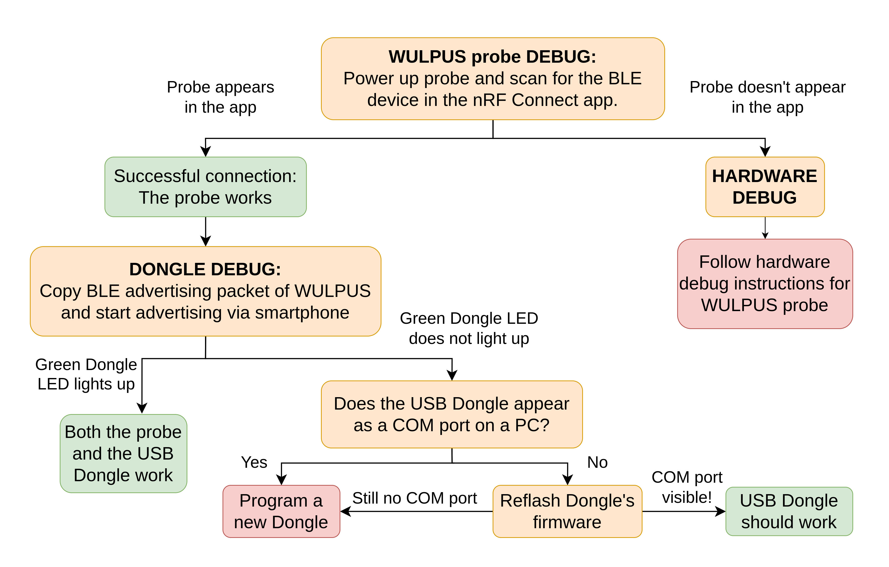
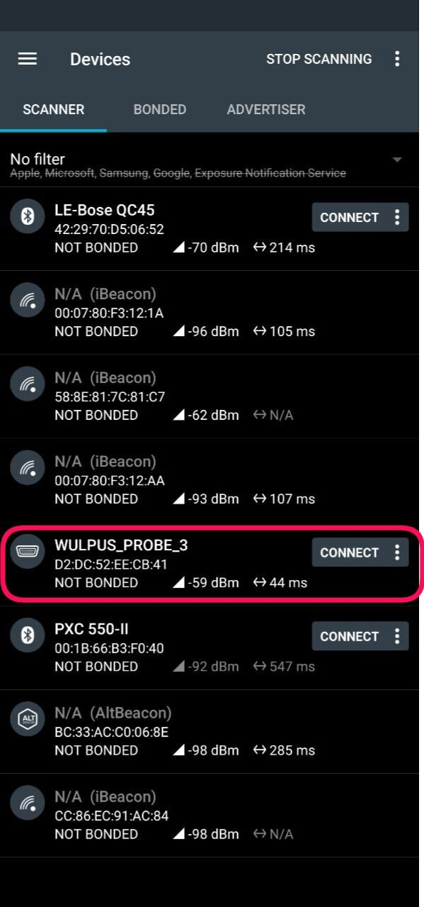
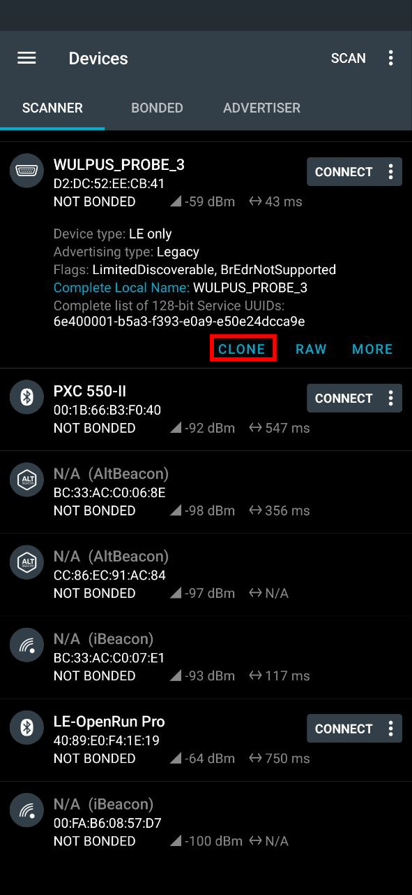
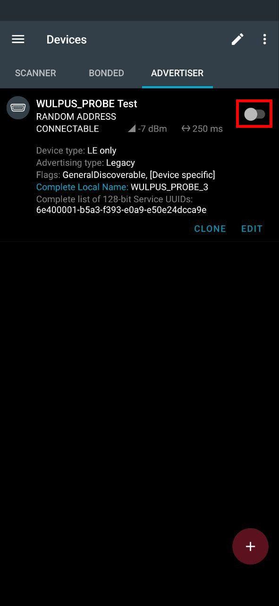

# Troubleshooting

If the system does not work (no BLE connection between WULPUS probe and Dongle confirmed by green LED), start debugging the individual components. A high-level overview of the debug action tree is shown below. The next subsections guide the user through this tree in detail.

*WULPUS system debug action tree.*

## BLE

BLE connection is the first indicator of the system's malfunctioning. Start with debugging the WULPUS probe.

### WULPUS Probe

To test the BLE connectivity of the WULPUS probe, go through the following steps:

1. (optional, recommended) Move to an environment free from BLE devices.
2. Power up the WULPUS probe from USB (but do not connect the USB Dongle).
    - If you power up from the Power supply (through the battery connector), configure the power supply to 3.7 – 4.1 V output with a current limit of at least 150 mA.
    - After the power-up, the power consumption of the configured and unpaired WULPUS probe should be around 13–15 mA.
3. Take an Android smartphone and download the [nRF Connect](https://play.google.com/store/apps/details?id=no.nordicsemi.android.mcp&hl=en&gl=US&pli=1) application.
4. Open the App and scan for BLE devices.
5. Find your device named **WULPUS_PROBE_X** (X is a unique number) as in figure (a) below. If your device does not appear, refer to [Hardware Debug](#hardware-debug).
6. If your device appears, click on the dedicated button to connect (see figure (a)). If the connection is successful, the WULPUS probe works.
7. Disconnect from the probe, scan again, find the probe, and click on the probe's name (without connecting). You should see the details of the device (see figure (b)).
8. Click on the **Clone button** (see figure (b)) to clone the advertising packet. We will need it to debug the Dongle.

{ width="30%" }
{ width="30%" }
{ width="30%" }

*Troubleshooting with nRF Connect app. (a) nRF Connect scan for BLE devices. (b) Advertising packet of WULPUS. (c) Advertising configuration.*

### USB Dongle

At the second step, the USB Dongle is tested. Follow the steps below:

1. After debugging the WULPUS probe, in the nRF App switch to the Advertiser Window.
2. You should see a configuration similar to the one in figure (c) above. You can rename this configuration (`WULPUS_PROBE_3` → `WULPUS_PROBE Test`) for convenience. If you don't have such a configuration, click on **+** and manually create it by adding all the fields (e.g. Device Type, UUIDs, etc). Change the **Complete Local Name** to your probe's name by clicking on the pen symbol in the top right area of the screen.

    !!! note
        Don't forget to encode the correct id **X** of the WULPUS probe (i.e. **WULPUS_PROBE_X**) in your **Complete Local Name**!

3. Plug the USB Dongle into a PC.
4. Enable advertiser configuration in the app by tapping the grey icon (in red box) on the top right of the Advertiser window (see figure (c)).
5. If the green Dongle LED lights up, the Dongle is working.
6. If the LED does not light up, check if you can find **a corresponding COM port** in the Windows Device Manager.

    !!! note
        For this, unplug the dongle and check the list of COM ports. Then plug the dongle in and check if a new COM port appeared.

7. If you can't find the device or something else is not working, reflash the Dongle firmware.

    !!! note
        Don't forget to change the WULPUS name by inserting the correct number in the firmware! For example, **WULPUS_PROBE_X** where **X=3** is the probe's id.

8. If you are here and nothing above worked, take a new fresh Dongle and flash it.

## Hardware

### Hardware Debug {#hardware-debug}

If the WULPUS probe does not appear in the nRF Connect app, follow the steps below:

1. Open and explore the schematics.
2. Power up the probe from the USB and probe the power domains on the connector P1 (it defines the USB-Battery power source selection).
3. If power from the USB does not arrive at the connector, power the probe from the Battery connector.
4. If power from the battery does not arrive at the P1 connector, power the probe from the lab supply through the middle pin of the connector.
5. Make sure all the power domains for nRF52 and MSP430 are powered up with the correct voltage levels.
6. Repeat the BLE tests.
7. If none of the above helps, reflash the firmware of the nRF and MSP.
8. If you are here, take another WULPUS probe.
