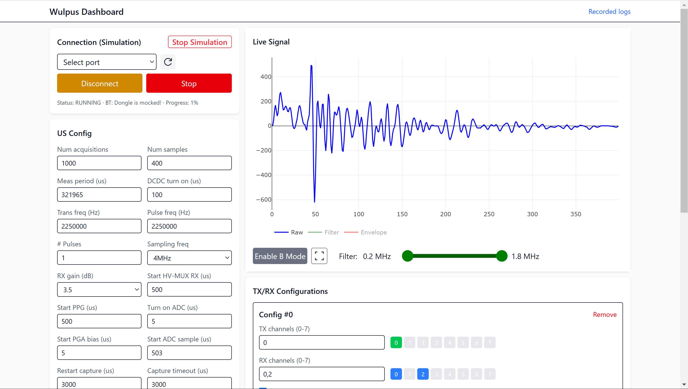

# WULPUS GUI source files
This directory contains the source files for WULPUS Graphical User Interface and an example Jupyter notebook ([wulpus_gui.ipynb](./jupyter%20notebook%20%28legacy%29/wulpus_gui.ipynb)).



# How to get started?
## Prebuilt GUI (Windows)
The simplest way to run the WULPUS GUI on Windows is to use the prebuilt executable:

1. Download the latest `wulpus-all-in-one` artifact from the [WULPUS releases page](https://github.com/pulp-bio/wulpus/releases/latest).
2. Extract the downloaded zip file.
3. Start `main.exe`.
4. Open [http://127.0.0.1:8000/](http://127.0.0.1:8000/) in your browser.

Windows may show a security warning because the executable is not signed. If you downloaded it from the official release page, choose "More info" and then "Run anyway".

## Run from source
The Jupyter notebook requires only the Python dependencies, while the web-based GUI also requires the Node.js dependencies.

### Install dependencies
Install [uv](https://docs.astral.sh/uv/getting-started/installation/), then install the Python dependencies from `sw`:

```sh
uv sync
```

Install the Node.js dependencies from `sw/wulpus-frontend`:

```sh
npm i
```

### Initial build
Build the frontend and copy the results into the backend's production frontend directory:

```sh
python build.py
```

### User interface
How to launch the user interface from source:

- After completing the initial build, open a new terminal and navigate into `/sw`
- Start the backend with uv:
```
    uv run python -m wulpus.main
```
You should be able to open a browser of your choice and visit [http://127.0.0.1:8000/](http://127.0.0.1:8000/)


#### Using the log file
The log recorded by the user interface is a zip file called `wulpus-{date}-id-{connection}.zip`.
The date is the start of the recording, with the connection describes which wulpus was used (MAC address or COM port).
It contains the config from the job, as well as the data in a [parquet](https://parquet.apache.org/) file.

The parquet file contains the following rows:
- `tx`: list of channels used for sending
- `rx`: list of channels used for receiving
- `aq_number`: ID increased by the wulpus (can be used to detect lost frames)
- `log_version`: the current version of the log-format. Constant over the whole file. 
- `tx_rx_id`: the index of the tx-rx-config used
- `0`, `1`, `2`, ...`{num samples - 1}`: the actual data, readout from ADC
- `__index_level_0__`: unix timestamp in us

You can use the jupyter notebook [visualize_log.ipynb](visualize_log.ipynb) to load a single or a set of multiple measurements and evaluate them.
There is also [MATLAB_load_wulpus_log.m](MATLAB_load_wulpus_log.m) to help import the logs into MATLAB.


### Jupyter notebook (legacy)
How to Launch an example Jupyter notebook:
- In a terminal launch:
```
    uv run --extra notebook jupyter notebook
```
This opens a webpage: Navigate to `jupyter notebook (legacy)` and click on `wulpus_gui.ipynb`.
Then, follow the instructions in the Notebook.


# More details
The folder structure inside `/sw` is as follows:
- `wulpus-frontend` is a React project for the interface you see in your browser
- `wulpus` is a FastAPI server that controls communication with wulpus.
- `jupyter notebook (legacy)` is a standalone python-only solution which uses a jupyter notebook for controlling wulpus. 

During the build-step of `wulpus-frontend`, the build results are copied inside `wulpus\production-frontend`. This is how the frontend can be served from the `wulpus` FastAPI project.


## Development
If you want to work on the frontend, it's easier to run the backend (`wulpus`) and the frontend (`wulpus-frontend`) separately.
This way you don't have to build after each step.

You can start the backend as usual (see above `uv run python -m wulpus.main`), but instead of visiting [http://127.0.0.1:8000/](http://127.0.0.1:8000/) in your browser, you start the development environment of the frontend:
- Open an additional terminal at `\sw\wulpus-frontend`
- run 
```
    npm run dev
```
- open the displayed link in your browser (probably [http://localhost:5173/](http://localhost:5173/))

This way, you access the frontend through its own dev server, which does hot reloading.
It still accesses the same backend, so everything still works exactly the same.

# License
The source files are released under Apache v2.0 (`Apache-2.0`) license unless noted otherwise, please refer to the `sw/LICENSE` file for details.
